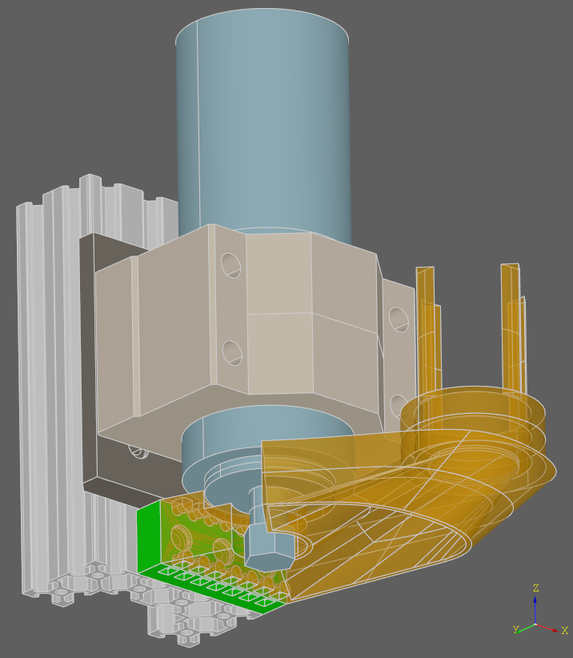

# CadQuery

[](https://ci.appveyor.com/project/jmwright/cadquery-o18bh/branch/master)
[](https://dev.azure.com/cadquery/conda-packages/_build/latest?definitionId=2&branchName=master)
[](https://codecov.io/gh/CadQuery/cadquery)
[](https://cadquery.readthedocs.io/en/latest/?badge=latest)
[](https://doi.org/10.5281/zenodo.4498634)


## What is CadQuery

CadQuery is an intuitive, easy-to-use Python module for building parametric 3D CAD models. Using CadQuery, you can write short, simple scripts that produce high quality CAD models. It is easy to make many different objects using a single script that can be customized.

CadQuery is often compared to [OpenSCAD](http://www.openscad.org/). Like OpenSCAD, CadQuery is an open-source, script based, parametric model generator. However, CadQuery stands out in many ways and has several key advantages:

1. The scripts use a standard programming language, Python, and thus can benefit from the associated infrastructure. This includes many standard libraries and IDEs.
2. CadQuery's CAD kernel Open CASCADE Technology ([OCCT](https://en.wikipedia.org/wiki/Open_Cascade_Technology)) is much more powerful than the [CGAL](https://en.wikipedia.org/wiki/CGAL) used by OpenSCAD. Features supported natively by OCCT include NURBS, splines, surface sewing, STL repair, STEP import/export, and other complex operations, in addition to the standard CSG operations supported by CGAL
3. Ability to import/export [STEP](https://en.wikipedia.org/wiki/ISO_10303) and the ability to begin with a STEP model, created in a CAD package, and then add parametric features. This is possible in OpenSCAD using STL, but STL is a lossy format.
4. CadQuery scripts require less code to create most objects, because it is possible to locate features based on the position of other features, workplanes, vertices, etc.
5. CadQuery scripts can build STL, STEP, and AMF faster than OpenSCAD.

### Key features
* Build 3D models with scripts that are as close as possible to how you would describe the object to a human.
* Create parametric models that can be very easily customized by end users.
* Output high quality (loss-less) CAD formats like STEP and DXF in addition to STL, VRML and AMF.
* Provide a non-proprietary, plain text model format that can be edited and executed with only a web browser.
* Offer advanced modeling capabilities such as fillets, curvilinear extrudes, parametric curves and lofts.
* Build nested assemblies out of individual parts and other assemblies.

### Why this fork

The original version of CadQuery was built on the FreeCAD API. This was great because it allowed for fast development and easy cross-platform capability. However, we eventually started reaching the limits of the API for some advanced operations and selectors. This 2.0 version of CadQuery is based directly on a Python wrapper of the OCCT kernel. This gives us a great deal more control and flexibility, at the expense of some simplicity and having to handle the cross-platform aspects of deployment ourselves. We believe this is a worthwhile trade-off to allow CadQuery to continue to grow and expand in the future.

## Getting started

To quickly play around with CadQuery and see it's capabilities, see the [CQ-editor GUI](https://github.com/CadQuery/CQ-editor) manual.  
If you want to use CadQuery for your own project, keep reading: 

It is currently possible to use CadQuery for your own projects in 3 different ways:
* Using the [CQ-editor GUI](https://github.com/CadQuery/CQ-editor)
* From a [Jupyter notebook](https://github.com/bernhard-42/jupyter-cadquery)
* As a standalone library
    * Linux [installation video](https://youtu.be/sjLTePOq8bQ)
    * Windows [installation video](https://youtu.be/3Tg_RJhqZRg)

The easiest way to install CadQuery and its dependencies is using conda, which is included as part of a [miniforge](https://github.com/conda-forge/miniforge) installation (other distributions can be used as well). See the next section for more details regarding conda. The steps to install cadquery are as follows:
```
# Set up a new environment
conda create -n cadquery

# Activate the new environment
conda activate cadquery

# CadQuery development is moving quickly, so it is best to install the latest version from GitHub master
conda install -c conda-forge -c cadquery cadquery=master
```

For those who are interested, the [OCP repository](https://github.com/CadQuery/OCP) contains the current OCCT wrapper used by CQ.

### Conda Installation

For those unfamiliar (or uncomfortable) with conda, it is probably best to install Miniforge to a local directory and to avoid running `conda init`. After performing a local directory installation, Miniforge can be activated via the [scripts,bin]/activate scripts. This will help avoid polluting and breaking the local Python installation. In Linux, the local directory installation method looks something like this:
```
# Install the script to ~/miniforge
wget https://github.com/conda-forge/miniforge/releases/latest/download/Miniforge3-Linux-x86_64.sh -O miniforge.sh
bash miniforge.sh -b -p $HOME/miniforge

# To activate and use Miniconda
source $HOME/miniforge/bin/activate
```
On Windows one can install locally as follows:
```
:: Install
curl -L -o miniforge.exe https://github.com/conda-forge/miniforge/releases/latest/download/Miniforge3-Windows-x86_64.exe
start /wait "" miniforge.exe /InstallationType=JustMe /RegisterPython=0 /NoRegistry=1 /NoScripts=1 /S /D=%USERPROFILE%\Miniforge3

:: Activate
cmd /K ""%USERPROFILE%/Miniforge3/Scripts/activate.bat" "%USERPROFILE%/Miniforge3""
```
You might want to consider using `/NoScripts=0` to have an activation shortcut added to the start menu.

### CQ-editor GUI

CQ-editor is an IDE that allows users to edit CadQuery model scripts in a GUI environment. It includes features such as:

* A graphical debugger that allows you to step through your scripts.
* A CadQuery stack inspector.
* Export to various formats, including STEP and STL, directly from the menu.

The installation instructions for CQ-editor can be found [here](https://github.com/CadQuery/CQ-editor#installation).


### Jupyter

CadQuery supports Jupyter notebook out of the box using the jupyter-cadquery extension created by @bernhard-42:

* [Installation](https://github.com/bernhard-42/jupyter-cadquery#installation)
* [Usage](https://github.com/bernhard-42/jupyter-cadquery#jupyter-cadquery)


### Docker

A list of Docker images can be found [here](https://github.com/RubenRubens/cq-containers), and includes images for the following projects.
* [Core CadQuery library](https://github.com/RubenRubens/cq-containers/tree/master/cq-conda), which allows users to run CadQuery Python scripts without a GUI.
* [cq-cli](https://github.com/RubenRubens/cq-containers/tree/master/cq-cli), a command line utility which is used to export the results of a CadQuery script to an output format (i.e. STL, STEP).
* [jupyter-cadquery](https://github.com/bernhard-42/jupyter-cadquery#b-using-a-docker-image), makes CadQuery accessible through Jupyter Labs and provides a web-based GUI. This is currently the only image that provides a GUI.

### Standalone Stable Version

CadQuery was built to be used as a Python library without any GUI. This makes it great for use cases such as integration into servers, or creating scientific and engineering scripts. Use Anaconda/Miniconda to install CadQuery, and then add `import cadquery` to the top of your Python scripts. If the stable version of CadQuery is desired, the following command will install it. However, be aware that the stable version can fall significantly behind the current state of CadQuery, so in many cases the `master` installation method at the beginning of the Getting Started section is preferable.

```
conda install -c conda-forge -c cadquery cadquery=2
```

## Getting help

You can find the full CadQuery documentation at [cadquery.readthedocs.io](https://cadquery.readthedocs.io/).

We also have a [Google Group](https://groups.google.com/forum/#!forum/cadquery) to make it easy to get help from other CadQuery users. We want you to feel welcome and encourage you to join the group and introduce yourself. We would also love to hear what you are doing with CadQuery.

There is a [Discord server](https://discord.gg/Bj9AQPsCfx) as well. You can ask for help in the _general_ channel.

## Projects using CadQuery

Here are just a few examples of how CadQuery is being used.

### FxBricks Lego Train System

[FxBricks](https://fxbricks.com/) uses CadQuery in the product development pipeline for their Lego train system. FxBricks has also given back to the community by creating [documentation for their CAD pipeline](https://github.com/fx-bricks/fx-cad-notes). They have also assembled [cq-kit](https://github.com/michaelgale/cq-kit), a library containing utility classes and functions to extend the capabilities of CadQuery. Thanks to @michaelgale and @fx-bricks for this example.


### Hexidor Board Game Development

Hexidor is an expanded take on the Quoridor board game, and the development process has been chronicled [here](https://bruceisonfire.net/2020/04/23/my-adventure-with-flosscad-the-birth-of-hexidor/). CadQuery was used to generate the game board. Thanks to Bruce for this example.


### Spindle assembly

Thanks to @marcus7070 for this example from [here](https://github.com/marcus7070/spindle-assy-example). 



### 3D Printed Resin Mold

Thanks to @eddieliberato for sharing [this example](https://jungletools.blogspot.com/2017/06/an-anti-kink-device-for-novel-high-tech.html) of an anti-kink resin mold for a cable.


## License

CadQuery is licensed under the terms of the [Apache Public License, version 2.0](http://www.apache.org/licenses/LICENSE-2.0).

## Contributing

Contributions from the community are welcome and appreciated.

You do not need to be a software developer to have a big impact on this project. Contributions can take many forms including, but not limited to, the following:

* Writing and improving documentation
* Triaging bugs
* Submitting bugs and feature requests
* Creating tutorial videos and blog posts
* Helping other users get started and solve problems
* Telling others about this project
* Helping with translations and internationalization
* Helping with accessibility
* Contributing bug fixes and new features

It is asked that all contributions to this project be made in a respectful and considerate way. Please use the [Python Community Code of Conduct's](https://www.python.org/psf/codeofconduct/) guidelines as a reference.

### Contributing code

If you are going to contribute code, make sure to follow this steps:

- Consider opening an issue first to discuss what you have in mind
- Try to keep it as short and simple as possible (if you want to change several
  things, start with just one!)
- Fork the CadQuery repository, clone your fork and create a new branch to
  start working on your changes
- Create a conda development environment with something like:
  - `conda env create -n cq-dev -f environment.yml`
- Activate the new conda environment:
  - `conda activate cq-dev`
- If desired, install the master branch of cq-editor (Note; a release version may not be compatible with the master branch of cadquery):
  - `conda install -c cadquery -c conda-forge cq-editor=master`
    Installing cq-editor adds another instance of cadquery which overrides the clone just added. Fix this by reinstalling cadquery using pip:
  - `pip install -e .`
- Before making any changes verify that the current tests pass. Run `pytest` from the root of your cadquery clone, there should be no failures and the output will look similar to this:
  - ======= 215 passed, 57 warnings in 13.95s =======
- Start with the tests! How should CadQuery behave after your changes? Make
  sure to add some tests to the test suite to ensure proper behavior
- Make sure your tests have assertions checking all the expected results
- Add a nice docstring to the test indicating what the test is doing; if there
  is too much to explain, consider splitting the test in two!
- Go ahead and implement the changes
- Add a nice docstring to the functions/methods/classes you implement
  describing what they do, what the expected parameters are and what it returns
  (if anything)
- Update the documentation if there is any change to the public API
- Consider adding an example to the documentation showing your cool new
  feature!
- Make sure nothing is broken (run the complete test suite with `pytest`)
- Run `black` to autoformat your code and make sure your code style complies
  with CadQuery's
- Push the changes to your fork and open a pull-request upstream
- Keep an eye on the automated feedback you will receive from the CI pipelines;
  if there is a test failing or some code is not properly formatted, you will
  be notified without human intervention
- Be prepared for constructive feedback and criticism!
- Be patient and respectful, remember that those reviewing your code are also
  working hard (sometimes reviewing changes is harder than implementing them!)

### How to Report a Bug
When filing a bug report [issue](https://github.com/CadQuery/cadquery/issues), please be sure to answer these questions:

1. What version of the software are you running?
2. What operating system are you running the software on?
3. What are the steps to reproduce the bug?

### How to Suggest a Feature or Enhancement

If you find yourself wishing for a feature that does not exist, you are probably not alone. There are bound to be others out there with similar needs. Open an [issue](https://github.com/CadQuery/cadquery/issues) which describes the feature you would like to see, why you need it, and how it should work.
