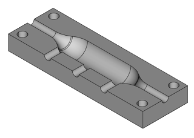
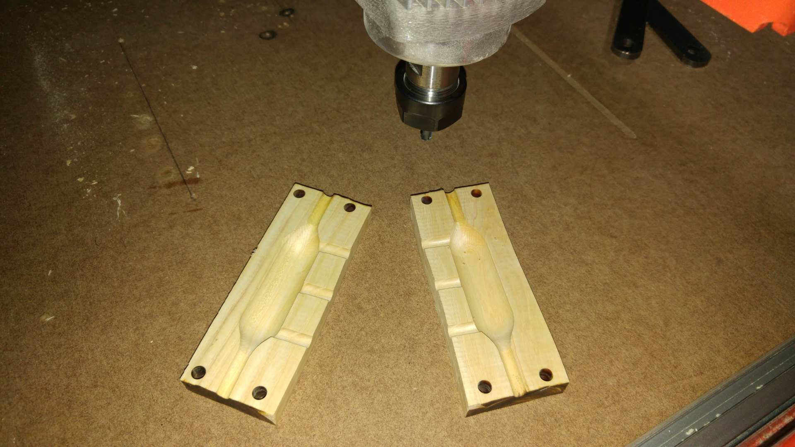

<p align="center">
   
</p>

What is a CadQuery?
========================================

[](https://travis-ci.org/dcowden/cadquery?branch=master)
[](https://coveralls.io/github/dcowden/cadquery?branch=master)
[](https://github.com/dcowden/cadquery/releases/tag/v0.3.0)
[](https://github.com/dcowden/cadquery/blob/master/LICENSE)

CadQuery is an intuitive, easy-to-use python based language for building parametric 3D CAD models.  CadQuery is for 3D CAD what jQuery is for javascript.  Imagine selecting Faces of a 3d object the same way you select DOM objects with JQuery!

CadQuery has several goals:

* Build lD models with scripts that are as close as possible to how you'd describe the object to a human.
* Create parametric models that can be very easily customized by end users
* Output high quality (loss-less) CAD formats like STEP and AMF in addition to traditional STL
* Provide a non-proprietary, plain text model format that can be edited and executed with only a web browser

Using CadQuery, you can write short, simple scripts that produce high quality CAD models.  It is easy to make many different objects using a single script that can be customized.

Full Documentation and a Welcoming Community
============================
You can find the full cadquery documentation at http://dcowden.github.io/cadquery

We also have a Google Group to make it easy to get help from other CadQuery users. We want you to feel welcome and encourage you to join the group and introduce yourself. We would also love to hear what you are doing with CadQuery. https://groups.google.com/forum/#!forum/cadquery

Getting Started With CadQuery
========================================

Installation instructions for all following use cases can be found [here](http://dcowden.github.io/cadquery/installation.html).

It is currently possible to use CadQuery for your own projects in 4 different ways:
  * as a plugin for FreeCAD
  * using the Docker Image to operate CadQuery as a CLI
  * as a plugin running on a Jupyter Notebook server
  * a standalone installation

## I just want to try things out!

If you are interested in trying CadQuery without installing anything, your best option is to experiment with CadQuery scripts running on a Jupyter server.

[](https://mybinder.org/v2/gh/RustyVermeer/tryCQ/master)

That button will launch a Jupyter Server pre-configured with CadQuery and its dependencies. It contains a folder with many useful examples to showcase CadQuery's features.

## I'd like to use CadQuery on my own setup

The easiest way to get started with CadQuery is to Install FreeCAD (version 16+)  (http://www.freecadweb.org/), and then to use our great CadQuery-FreeCAD plugin here: https://github.com/jmwright/cadquery-freecad-module

It includes the latest version of cadquery already bundled, and has super-easy installation on Mac, Windows, and Unix.

It has tons of awesome features like integration with FreeCAD so you can see your objects, code-autocompletion, an examples bundle, and script saving/loading. Its definitely the best way to kick the tires!

## I have other ideas and want to run things my own way

Awesome! CadQuery is built with this attitude in mind. If none of the existing usage methods work for you, you are more than welcome to forge your own path. You'll probably find the most success using the Docker image. You can alternatively install CadQuery as a standalone package.

Getting Started with the docker image
=======================================
The CadQuery docker image (https://hub.docker.com/r/dcowden/cadquery/)  includes cadquery and all of its dependencies. It can be used to run cadquery scripts without any installation required ( other than docker, of course)

Examples:

Display the Documentation::

     docker run dcowden/cadquery:latest

Build a local model using stdin/stdout::

     cat Ex001_Simple_Block.py | docker run -i dcowden/cadquery:latest build --in_spec stdin --format STEP --out_spec stdout

     ... STEP output on the console

Build local models and output to the same directory:

     docker run -v $PWD:/home/cq -i dcowden/cadquery:latest build --in_spec Ex001_Simple_Block.py --format STEP
     INFO: Reading from file 'Ex001_Simple_Block.py'
     INFO: Parsed Script 'Ex001_Simple_Block.py'.
     INFO: This script provides parameters length,thickness,height, which can be customized at build time.
     INFO: The script will run with default variable values
     INFO: use --param_file to provide a json file that contains values to override the defaults
     INFO: Output Format is 'STEP'. Use --output-format to change it.
     INFO: Output Path is './cqobject-%(counter)d.%(format)s'. Use --out_spec to change it.
     INFO: Script Generated 1 result Objects
     INFO: Writing STEP Output to './cqobject-1.STEP'

Projects Using CadQuery
=========================

This resin mold was modeled using cadquery and then created on a CNC machine:

<p align="center">
   
   
</p>

The cadquery script is surprisingly short, and allows easily customizing any of the variables::

```python
	import cadquery as cq
	from Helpers import show
	BS = cq.selectors.BoxSelector

	# PARAMETERS
	mount_holes = True

	# mold size
	mw = 40
	mh = 13
	ml = 120

	# wire and fix size
	wd = 6  # wire diameter
	rt = 7  # resin thickness
	rl = 50  # resin length
	rwpl = 10  # resin to wire pass length

	# pocket fillet
	pf = 18

	# mount holes
	mhd = 7  # hole diameter
	mht = 3  # hole distance from edge

	# filling hole
	fhd = 6

	# DRAWING

	# draw base
	base = cq.Workplane("XY").box(ml, mw, mh, (True, True, False))

	# draw wire
	pocket = cq.Workplane("XY", (0, 0, mh)).moveTo(-ml/2., 0).line(0, wd/2.)\
	    .line((ml-rl)/2.-rwpl, 0).line(rwpl, rt).line(rl, 0)\
	    .line(rwpl, -rt).line((ml-rl)/2.-rwpl, 0)\
	    .line(0, -(wd/2.)).close().revolve(axisEnd=(1, 0))\
	    .edges(BS((-rl/2.-rwpl-.1, -100, -100), (rl/2.+rwpl+.1, 100, 100)))\
	    .fillet(pf)

	r = base.cut(pocket)

	# mount holes
	if mount_holes:
	    px = ml/2.-mht-mhd/2.
	    py = mw/2.-mht-mhd/2
	    r = r.faces("<Z").workplane().pushPoints([
		(px, py),
		(-px, py),
		(-px, -py),
		(px, -py)
		]).hole(mhd)

	# fill holes
	r = r.faces("<Y").workplane().center(0, mh/2.).pushPoints([
	    (-rl/2., 0),
	    (0, 0),
	    (rl/2., 0)
	    ]).hole(fhd, mw/2.)

	show(r)
```

Thanks go to cadquery contributor hyOzd ( Altu Technology ) for the example!


KiCad uses cadquery to build high quality models of electrictronic components. ( https://github.com/KiCad/packages3D )

<p align="center">
   
</p>

This Prusa i3 extruder support uses cadquery to build the model (https://github.com/adam-urbanczyk/cadquery-models) :

<p align="center">
   
</p>

The mach30 project used cadquery to develop a tool that will create a rocket thruster directly from the appropriate equations (https://opendesignengine.net/projects/yavin-thruster/wiki):
<p align="center">
   
</p>

This example uses Jupyter notebook to produce a really cool web-based scripting environment ( https://github.com/RustyVermeer/avnb/blob/master/readme.md ) :

<p align="center">
   
</p>


We would love to link to your cadquery based project. Just let us know and we'll add it here.


Where does the name CadQuery come from?
========================================

CadQuery is inspired by jQuery, a popular framework that
revolutionized web development involving javascript.

If you are familiar with jQuery, you will probably recognize several jQuery features that CadQuery uses:

* A fluent api to create clean, easy to read code
* Language features that make selection and iteration incredibly easy
*
* Ability to use the library along side other python libraries
* Clear and complete documentation, with plenty of samples.

Why CadQuery instead of OpenSCAD?
========================================

CadQuery is based on OpenCasCade.  CadQuery shares many features with OpenSCAD, another open source, script based, parametric model generator.

The primary advantage of OpenSCAD is the large number of already existing model libaries  that exist already. So why not simply use OpenSCAD?

CadQuery scripts have several key advantages over OpenSCAD:

1. **The scripts use a standard programming language**, python, and thus can benefit from the associated infrastructure.
   This includes many standard libraries and IDEs

2. **More powerful CAD kernel** OpenCascade is much more powerful than CGAL. Features supported natively
   by OCC include NURBS, splines, surface sewing, STL repair, STEP import/export,  and other complex operations,
   in addition to the standard CSG operations supported by CGAL

3. **Ability to import/export STEP** We think the ability to begin with a STEP model, created in a CAD package,
   and then add parametric features is key.  This is possible in OpenSCAD using STL, but STL is a lossy format

4. **Less Code and easier scripting**  CadQuery scripts require less code to create most objects, because it is possible to locate
   features based on the position of other features, workplanes, vertices, etc.

5. **Better Performance**  CadQuery scripts can build STL, STEP, and AMF faster than OpenSCAD.

License
========

CadQuery is licensed under the terms of the Apache Public License, version 2.0.
A copy of the license can be found at http://www.apache.org/licenses/LICENSE-2.0

Ongoing and Future Work
============

### CadQuery GUI (under development)
Work is underway on a stand-alone gui here:  https://github.com/jmwright/cadquery-gui

### CadQuery Parts / Assembly Handling
Work by Fragmuffin is ongoing with the [cqparts](https://github.com/fragmuffin/cqparts) repo.

### Moving to Python3 and away from FreeCAD as a dependency
Adam Urbańczyk has been working hard on his own [CQ fork](https://github.com/adam-urbanczyk/cadquery) which uses only PythonOCC instead of FreeCAD.

Work has begun on Cadquery 2.0, which will feature:

   1. Feature trees, for more powerful selection
   2. Direct use of OpenCascade Community Edition(OCE), so that it is no longer required to install FreeCAD
   3. https://github.com/jmwright/cadquery-gui, which will allow visualization of workplanes  

The project page can be found here: https://github.com/dcowden/cadquery/projects/1

A more detailed description of the plan for CQ 2.0 is here: https://docs.google.com/document/d/1cXuxBkVeYmGOo34MGRdG7E3ILypQqkrJ26oVf3CUSPQ
