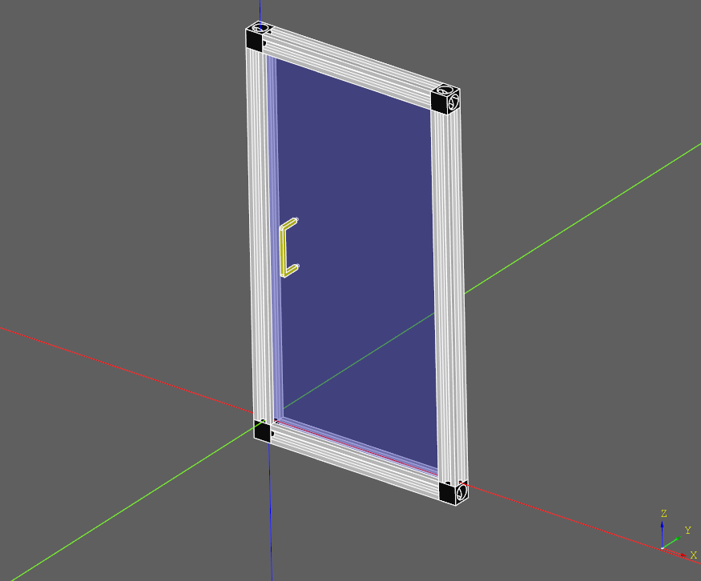

.. _assytutorial:

***********************
Assembly Tutorial
***********************

Introduction
============

The purpose of this section is to demonstrate how to use the assembly and constraints
functionality to build a realistic model. It will be a enclosure door assembly made out of 20x20 v-slot profiles.

Defining parameters
===================

We want to start with defining the model parameters to allow for easy dimension changes later:

.. code-block:: python
   :linenos:

    import cadquery as cq
    
    # Parameters
    H = 400
    W = 200
    D = 350
    
    PROFILE = cq.importers.importDXF("vslot-2020_1.dxf").wires()
    
    SLOT_D = 5
    PANEL_T = 3
    
    HANDLE_D = 20
    HANDLE_L = 50
    HANDLE_W = 4
    
It is interesting to note that the v-slot profile is imported from a DXF file.
This way it is very easy to change to other aluminum extrusion type, e.g. Item or Bosch.
Vendors usually provide DXF files.

Defining reusable components
============================

Next we want to define functions generating the assembly components based on the specified parameters.

.. code-block:: python
   :linenos:

    def make_vslot(l):
    
        return PROFILE.toPending().extrude(l)
    
    
    def make_connector():
    
        rv = (
            cq.Workplane()
            .box(20, 20, 20)
            .faces("<X")
            .workplane()
            .cboreHole(6, 15, 18)
            .faces("<Z")
            .workplane()
            .cboreHole(6, 15, 18)
        )
    
        # tag mating faces
        rv.faces(">X").tag("X").end()
        rv.faces(">Z").tag("Z").end()
    
        return rv
    
    
    def make_panel(w, h, t, cutout):
    
        rv = (
            cq.Workplane("XZ")
            .rect(w, h)
            .extrude(t)
            .faces(">Y")
            .vertices()
            .rect(2*cutout,2*cutout)
            .cutThruAll()
            .faces("<Y")
            .workplane()
            .pushPoints([(-w / 3, HANDLE_L / 2), (-w / 3, -HANDLE_L / 2)])
            .hole(3)
        )
    
        # tag mating edges
        rv.faces(">Y").edges("%CIRCLE").edges(">Z").tag("hole1")
        rv.faces(">Y").edges("%CIRCLE").edges("<Z").tag("hole2")
    
        return rv
    
    
    def make_handle(w, h, r):
    
        pts = ((0, 0), (w, 0), (w, h), (0, h))
    
        path = cq.Workplane().polyline(pts)
    
        rv = (
            cq.Workplane("YZ")
            .rect(r, r)
            .sweep(path, transition="round")
            .tag("solid")
            .faces("<X")
            .workplane()
            .faces("<X", tag="solid")
            .hole(r / 1.5)
        )
        
        # tag mating faces
        rv.faces("<X").faces(">Y").tag("mate1")
        rv.faces("<X").faces("<Y").tag("mate2")
    
        return rv
        
Initial assembly
================

Next we want to instantiate all the components and add them to the assembly.

.. code-block:: python
  :linenos:
   
    # define the elements
    door = (
        cq.Assembly()
        .add(make_vslot(H), name="left")
        .add(make_vslot(H), name="right")
        .add(make_vslot(W), name="top")
        .add(make_vslot(W), name="bottom")
        .add(make_connector(), name="con_tl", color=cq.Color("black"))
        .add(make_connector(), name="con_tr", color=cq.Color("black"))
        .add(make_connector(), name="con_bl", color=cq.Color("black"))
        .add(make_connector(), name="con_br", color=cq.Color("black"))
        .add(
            make_panel(W + SLOT_D, H + SLOT_D, PANEL_T),
            name="panel",
            color=cq.Color(0, 0, 1, 0.2),
        )
        .add(
            make_handle(HANDLE_D, HANDLE_L, HANDLE_W),
            name="handle",
            color=cq.Color("yellow"),
        )
    )
    
Constraints definition
======================

Then we want to define all the constraints

.. code-block:: python
   :linenos:

    # define the constraints
    (
        door
        # left profile
        .constrain("left@faces@<Z", "con_bl?Z", "Plane")
        .constrain("left@faces@<X", "con_bl?X", "Axis")
        .constrain("left@faces@>Z", "con_tl?Z", "Plane")
        .constrain("left@faces@<X", "con_tl?X", "Axis")
        # top
        .constrain("top@faces@<Z", "con_tl?X", "Plane")
        .constrain("top@faces@<Y", "con_tl@faces@>Y", "Axis")
        # bottom
        .constrain("bottom@faces@<Y", "con_bl@faces@>Y", "Axis")
        .constrain("bottom@faces@>Z", "con_bl?X", "Plane")
        # right connectors
        .constrain("top@faces@>Z", "con_tr@faces@>X", "Plane")
        .constrain("bottom@faces@<Z", "con_br@faces@>X", "Plane")
        .constrain("left@faces@>Z", "con_tr?Z", "Axis")
        .constrain("left@faces@<Z", "con_br?Z", "Axis")
        # right profile
        .constrain("right@faces@>Z", "con_tr@faces@>Z", "Plane")
        .constrain("right@faces@<X", "left@faces@<X", "Axis")
        # panel
        .constrain("left@faces@>X[-4]", "panel@faces@<X", "Plane")
        .constrain("left@faces@>Z", "panel@faces@>Z", "Axis")
        # handle
        .constrain("panel?hole1", "handle?mate1", "Plane")
        .constrain("panel?hole2", "handle?mate2", "Point")
    )

Final result
============

Below is the complete code including the final solve step.

.. code-block:: python
   :linenos:

    import cadquery as cq
    
    # Parameters
    H = 400
    W = 200
    D = 350
    
    PROFILE = cq.importers.importDXF("vslot-2020_1.dxf").wires()
    
    SLOT_D = 6
    PANEL_T = 3
    
    HANDLE_D = 20
    HANDLE_L = 50
    HANDLE_W = 4
    
    
    def make_vslot(l):
    
        return PROFILE.toPending().extrude(l)
    
    
    def make_connector():
    
        rv = (
            cq.Workplane()
            .box(20, 20, 20)
            .faces("<X")
            .workplane()
            .cboreHole(6, 15, 18)
            .faces("<Z")
            .workplane()
            .cboreHole(6, 15, 18)
        )
    
        # tag mating faces
        rv.faces(">X").tag("X").end()
        rv.faces(">Z").tag("Z").end()
    
        return rv
    
    
    def make_panel(w, h, t, cutout):
    
        rv = (
            cq.Workplane("XZ")
            .rect(w, h)
            .extrude(t)
            .faces(">Y")
            .vertices()
            .rect(2*cutout,2*cutout)
            .cutThruAll()
            .faces("<Y")
            .workplane()
            .pushPoints([(-w / 3, HANDLE_L / 2), (-w / 3, -HANDLE_L / 2)])
            .hole(3)
        )
    
        # tag mating edges
        rv.faces(">Y").edges("%CIRCLE").edges(">Z").tag("hole1")
        rv.faces(">Y").edges("%CIRCLE").edges("<Z").tag("hole2")
    
        return rv
    
    
    def make_handle(w, h, r):
    
        pts = ((0, 0), (w, 0), (w, h), (0, h))
    
        path = cq.Workplane().polyline(pts)
    
        rv = (
            cq.Workplane("YZ")
            .rect(r, r)
            .sweep(path, transition="round")
            .tag("solid")
            .faces("<X")
            .workplane()
            .faces("<X", tag="solid")
            .hole(r / 1.5)
        )
        
        # tag mating faces
        rv.faces("<X").faces(">Y").tag("mate1")
        rv.faces("<X").faces("<Y").tag("mate2")
    
        return rv
    
    
    # define the elements
    door = (
        cq.Assembly()
        .add(make_vslot(H), name="left")
        .add(make_vslot(H), name="right")
        .add(make_vslot(W), name="top")
        .add(make_vslot(W), name="bottom")
        .add(make_connector(), name="con_tl", color=cq.Color("black"))
        .add(make_connector(), name="con_tr", color=cq.Color("black"))
        .add(make_connector(), name="con_bl", color=cq.Color("black"))
        .add(make_connector(), name="con_br", color=cq.Color("black"))
        .add(
            make_panel(W + 2*SLOT_D, H + 2*SLOT_D, PANEL_T, SLOT_D),
            name="panel",
            color=cq.Color(0, 0, 1, 0.2),
        )
        .add(
            make_handle(HANDLE_D, HANDLE_L, HANDLE_W),
            name="handle",
            color=cq.Color("yellow"),
        )
    )
    
    # define the constraints
    (
        door
        # left profile
        .constrain("left@faces@<Z", "con_bl?Z", "Plane")
        .constrain("left@faces@<X", "con_bl?X", "Axis")
        .constrain("left@faces@>Z", "con_tl?Z", "Plane")
        .constrain("left@faces@<X", "con_tl?X", "Axis")
        # top
        .constrain("top@faces@<Z", "con_tl?X", "Plane")
        .constrain("top@faces@<Y", "con_tl@faces@>Y", "Axis")
        # bottom
        .constrain("bottom@faces@<Y", "con_bl@faces@>Y", "Axis")
        .constrain("bottom@faces@>Z", "con_bl?X", "Plane")
        # right connectors
        .constrain("top@faces@>Z", "con_tr@faces@>X", "Plane")
        .constrain("bottom@faces@<Z", "con_br@faces@>X", "Plane")
        .constrain("left@faces@>Z", "con_tr?Z", "Axis")
        .constrain("left@faces@<Z", "con_br?Z", "Axis")
        # right profile
        .constrain("right@faces@>Z", "con_tr@faces@>Z", "Plane")
        .constrain("right@faces@<X", "left@faces@<X", "Axis")
        # panel
        .constrain("left@faces@>X[-4]", "panel@faces@<X", "Plane")
        .constrain("left@faces@>Z", "panel@faces@>Z", "Axis")
        # handle
        .constrain("panel?hole1", "handle?mate1", "Plane")
        .constrain("panel?hole2", "handle?mate2", "Point")
    )
    
    # solve
    door.solve()
    
    show_object(door,name='door')

This code generates the following assembly.
    

Data export
===========

The resulting assembly can be exported as a STEP file or in a internal OCCT XML format.

STEP can be loaded in all CAD tool, e.g. in FreeCAD and the XML be used in other applications using OCCT.

.. code-block:: python
   :linenos:

    door.save('door.step')
    door.save('door.xml')
    
In the case of STEP colors are preserved but not transparency.

..  image:: _static/door_assy_freecad.png