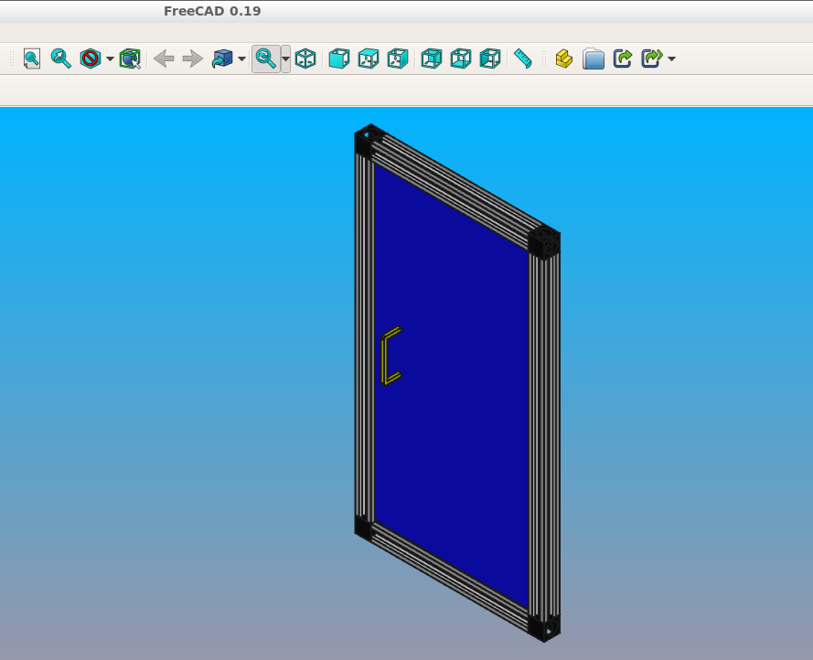

.. _assytutorial:

**********
Assemblies
**********

Assembly tutorial
-----------------

The purpose of this section is to demonstrate how to use the assembly and constraints
functionality to build a realistic model. It will be a enclosure door assembly made out of 20x20 v-slot profiles.

Defining parameters
===================

We want to start with defining the model parameters to allow for easy dimension changes later:

.. code-block:: python

    import cadquery as cq
    
    # Parameters
    H = 400
    W = 200
    D = 350
    
    PROFILE = cq.importers.importDXF("vslot-2020_1.dxf").wires()
    
    SLOT_D = 5
    PANEL_T = 3
    
    HANDLE_D = 20
    HANDLE_L = 50
    HANDLE_W = 4
    
It is interesting to note that the v-slot profile is imported from a DXF file.
This way it is very easy to change to other aluminum extrusion type, e.g. Item or Bosch.
Vendors usually provide DXF files.

Defining reusable components
============================

Next we want to define functions generating the assembly components based on the specified parameters.

.. code-block:: python

    def make_vslot(l):
    
        return PROFILE.toPending().extrude(l)
    
    
    def make_connector():
    
        rv = (
            cq.Workplane()
            .box(20, 20, 20)
            .faces("<X")
            .workplane()
            .cboreHole(6, 15, 18)
            .faces("<Z")
            .workplane(centerOption="CenterOfMass")
            .cboreHole(6, 15, 18)
        )
    
        # tag mating faces
        rv.faces(">X").tag("X").end()
        rv.faces(">Z").tag("Z").end()
    
        return rv
    
    
    def make_panel(w, h, t, cutout):
    
        rv = (
            cq.Workplane("XZ")
            .rect(w, h)
            .extrude(t)
            .faces(">Y")
            .vertices()
            .rect(2*cutout,2*cutout)
            .cutThruAll()
            .faces("<Y")
            .workplane()
            .pushPoints([(-w / 3, HANDLE_L / 2), (-w / 3, -HANDLE_L / 2)])
            .hole(3)
        )
    
        # tag mating edges
        rv.faces(">Y").edges("%CIRCLE").edges(">Z").tag("hole1")
        rv.faces(">Y").edges("%CIRCLE").edges("<Z").tag("hole2")
    
        return rv
    
    
    def make_handle(w, h, r):
    
        pts = ((0, 0), (w, 0), (w, h), (0, h))
    
        path = cq.Workplane().polyline(pts)
    
        rv = (
            cq.Workplane("YZ")
            .rect(r, r)
            .sweep(path, transition="round")
            .tag("solid")
            .faces("<X")
            .workplane()
            .faces("<X", tag="solid")
            .hole(r / 1.5)
        )
        
        # tag mating faces
        rv.faces("<X").faces(">Y").tag("mate1")
        rv.faces("<X").faces("<Y").tag("mate2")
    
        return rv
        
Initial assembly
================

Next we want to instantiate all the components and add them to the assembly.

.. code-block:: python
   
    # define the elements
    door = (
        cq.Assembly()
        .add(make_vslot(H), name="left")
        .add(make_vslot(H), name="right")
        .add(make_vslot(W), name="top")
        .add(make_vslot(W), name="bottom")
        .add(make_connector(), name="con_tl", color=cq.Color("black"))
        .add(make_connector(), name="con_tr", color=cq.Color("black"))
        .add(make_connector(), name="con_bl", color=cq.Color("black"))
        .add(make_connector(), name="con_br", color=cq.Color("black"))
        .add(
            make_panel(W + SLOT_D, H + SLOT_D, PANEL_T, SLOT_D),
            name="panel",
            color=cq.Color(0, 0, 1, 0.2),
        )
        .add(
            make_handle(HANDLE_D, HANDLE_L, HANDLE_W),
            name="handle",
            color=cq.Color("yellow"),
        )
    )
    
Constraints definition
======================

Then we want to define all the constraints

.. code-block:: python

    # define the constraints
    (
        door
        # left profile
        .constrain("left@faces@<Z", "con_bl?Z", "Plane")
        .constrain("left@faces@<X", "con_bl?X", "Axis")
        .constrain("left@faces@>Z", "con_tl?Z", "Plane")
        .constrain("left@faces@<X", "con_tl?X", "Axis")
        # top
        .constrain("top@faces@<Z", "con_tl?X", "Plane")
        .constrain("top@faces@<Y", "con_tl@faces@>Y", "Axis")
        # bottom
        .constrain("bottom@faces@<Y", "con_bl@faces@>Y", "Axis")
        .constrain("bottom@faces@>Z", "con_bl?X", "Plane")
        # right connectors
        .constrain("top@faces@>Z", "con_tr@faces@>X", "Plane")
        .constrain("bottom@faces@<Z", "con_br@faces@>X", "Plane")
        .constrain("left@faces@>Z", "con_tr?Z", "Axis")
        .constrain("left@faces@<Z", "con_br?Z", "Axis")
        # right profile
        .constrain("right@faces@>Z", "con_tr@faces@>Z", "Plane")
        .constrain("right@faces@<X", "left@faces@<X", "Axis")
        # panel
        .constrain("left@faces@>X[-4]", "panel@faces@<X", "Plane")
        .constrain("left@faces@>Z", "panel@faces@>Z", "Axis")
        # handle
        .constrain("panel?hole1", "handle?mate1", "Plane")
        .constrain("panel?hole2", "handle?mate2", "Point")
    )
    
Should you need to do something unusual that is not possible with the string
based selectors (e.g. use :py:class:`cadquery.selectors.BoxSelector` or a user-defined selector class),
it is possible to pass :py:class:`cadquery.Shape` objects to the :py:meth:`cadquery.Assembly.constrain` method directly. For example, the above

.. code-block:: python

    .constrain('part1@faces@>Z','part3@faces@<Z','Axis')

is equivalent to

.. code-block:: python

    .constrain('part1',part1.faces('>z').val(),'part3',part3.faces('<Z').val(),'Axis')

This method requires a :py:class:`cadquery.Shape` object, so remember to use the :py:meth:`cadquery.Workplane.val`
method to pass a single :py:class:`cadquery.Shape` and not the whole :py:class:`cadquery.Workplane` object.

Final result
============

Below is the complete code including the final solve step.

.. cadquery::
    :height: 600px

    import cadquery as cq
    
    # Parameters
    H = 400
    W = 200
    D = 350
    
    PROFILE = cq.importers.importDXF("vslot-2020_1.dxf").wires()
    
    SLOT_D = 6
    PANEL_T = 3
    
    HANDLE_D = 20
    HANDLE_L = 50
    HANDLE_W = 4
    
    
    def make_vslot(l):
    
        return PROFILE.toPending().extrude(l)
    
    
    def make_connector():
    
        rv = (
            cq.Workplane()
            .box(20, 20, 20)
            .faces("<X")
            .workplane()
            .cboreHole(6, 15, 18)
            .faces("<Z")
            .workplane(centerOption="CenterOfMass")
            .cboreHole(6, 15, 18)
        )
    
        # tag mating faces
        rv.faces(">X").tag("X").end()
        rv.faces(">Z").tag("Z").end()
    
        return rv
    
    
    def make_panel(w, h, t, cutout):
    
        rv = (
            cq.Workplane("XZ")
            .rect(w, h)
            .extrude(t)
            .faces(">Y")
            .vertices()
            .rect(2*cutout,2*cutout)
            .cutThruAll()
            .faces("<Y")
            .workplane()
            .pushPoints([(-w / 3, HANDLE_L / 2), (-w / 3, -HANDLE_L / 2)])
            .hole(3)
        )
    
        # tag mating edges
        rv.faces(">Y").edges("%CIRCLE").edges(">Z").tag("hole1")
        rv.faces(">Y").edges("%CIRCLE").edges("<Z").tag("hole2")
    
        return rv
    
    
    def make_handle(w, h, r):
    
        pts = ((0, 0), (w, 0), (w, h), (0, h))
    
        path = cq.Workplane().polyline(pts)
    
        rv = (
            cq.Workplane("YZ")
            .rect(r, r)
            .sweep(path, transition="round")
            .tag("solid")
            .faces("<X")
            .workplane()
            .faces("<X", tag="solid")
            .hole(r / 1.5)
        )
        
        # tag mating faces
        rv.faces("<X").faces(">Y").tag("mate1")
        rv.faces("<X").faces("<Y").tag("mate2")
    
        return rv
    
    
    # define the elements
    door = (
        cq.Assembly()
        .add(make_vslot(H), name="left")
        .add(make_vslot(H), name="right")
        .add(make_vslot(W), name="top")
        .add(make_vslot(W), name="bottom")
        .add(make_connector(), name="con_tl", color=cq.Color("black"))
        .add(make_connector(), name="con_tr", color=cq.Color("black"))
        .add(make_connector(), name="con_bl", color=cq.Color("black"))
        .add(make_connector(), name="con_br", color=cq.Color("black"))
        .add(
            make_panel(W + 2*SLOT_D, H + 2*SLOT_D, PANEL_T, SLOT_D),
            name="panel",
            color=cq.Color(0, 0, 1, 0.2),
        )
        .add(
            make_handle(HANDLE_D, HANDLE_L, HANDLE_W),
            name="handle",
            color=cq.Color("yellow"),
        )
    )
    
    # define the constraints
    (
        door
        # left profile
        .constrain("left@faces@<Z", "con_bl?Z", "Plane")
        .constrain("left@faces@<X", "con_bl?X", "Axis")
        .constrain("left@faces@>Z", "con_tl?Z", "Plane")
        .constrain("left@faces@<X", "con_tl?X", "Axis")
        # top
        .constrain("top@faces@<Z", "con_tl?X", "Plane")
        .constrain("top@faces@<Y", "con_tl@faces@>Y", "Axis")
        # bottom
        .constrain("bottom@faces@<Y", "con_bl@faces@>Y", "Axis")
        .constrain("bottom@faces@>Z", "con_bl?X", "Plane")
        # right connectors
        .constrain("top@faces@>Z", "con_tr@faces@>X", "Plane")
        .constrain("bottom@faces@<Z", "con_br@faces@>X", "Plane")
        .constrain("left@faces@>Z", "con_tr?Z", "Axis")
        .constrain("left@faces@<Z", "con_br?Z", "Axis")
        # right profile
        .constrain("right@faces@>Z", "con_tr@faces@>Z", "Plane")
        .constrain("right@faces@<X", "left@faces@<X", "Axis")
        # panel
        .constrain("left@faces@>X[-4]", "panel@faces@<X", "Plane")
        .constrain("left@faces@>Z", "panel@faces@>Z", "Axis")
        # handle
        .constrain("panel?hole1", "handle?mate1", "Plane")
        .constrain("panel?hole2", "handle?mate2", "Point")
    )
    
    # solve
    door.solve()
    
    show_object(door,name='door')

Data export
===========

The resulting assembly can be exported as a STEP file or in a internal OCCT XML format.

STEP can be loaded in all CAD tool, e.g. in FreeCAD and the XML be used in other applications using OCCT.

.. code-block:: python
   :linenos:

    door.save('door.step')
    door.save('door.xml')
    
In the case of STEP colors are preserved but not transparency.

Object locations
----------------

Objects can be added to an assembly with initial locations supplied, such as:

.. cadquery::

    import cadquery as cq

    cone = cq.Solid.makeCone(1, 0, 2)

    assy = cq.Assembly()
    assy.add(
        cone,
        loc=cq.Location(cq.Vector(0, 0, 0), cq.Vector(1, 0, 0), 180),
        name="cone0",
        color=cq.Color("green")
    )
    assy.add(cone, name="cone1", color=cq.Color("blue"))

    show_object(assy)

As an alternative to the user calculating locations, constraints and the method
:meth:`~cadquery.Assembly.solve` can be used to position objects in an assembly.

If initial locations and the method :meth:`~cadquery.Assembly.solve` are used the solver will
overwrite these initial locations with it's solution, however initial locations can still affect the
final solution. In an underconstrained system the solver may not move an object if it does not
contribute to the cost function, or if multiple solutions exist (ie. multiple instances
where the cost function is at a minimum) initial locations can cause the solver to converge on one
particular solution. For very complicated assemblies setting approximately correct initial locations
can also reduce the computational time requred.

Constraints
-----------

Constraints are often a better representation of the real world relationship the user wants to
model than directly supplying locations. In the above example the real world relationship is that
the bottom face of each cone should touch, which can be modelled with a Plane constraint. When the
user provides explicit locations (instead of constraints) then they are also reponsible for updating
them when, for example, the location of ``cone1`` changes.

When at least one constraint is supplied and the method :meth:`~cadquery.Assembly.solve` is run, an
optimization problem is set up. Each constraint provides a cost function that depends on the
position and orientation (represented by a :class:`~cadquery.Location`) of the two objects specified
when creating the constraint. The solver varies the location of the assembly's children and attempts
to minimize the sum of all cost functions. Hence by reading the formulae of the cost functions
below, you can understand exactly what each constraint does.

Point
=====

The Point constraint is a frequently used constraint that minimizes the distance between two points.
Some example uses are centering faces or aligning verticies, but it is also useful with dummy
vertices to create offsets between two parts.

The cost function is:

.. math::

  ( param - \lvert \vec{ c_1 } - \vec{ c_2 } \rvert ) ^2

Where:

- :math:`param` is the parameter of the constraint, which defaults to 0,
- :math:`\vec{ c_i }` is the center of the ith object, and
- :math:`\lvert \vec{ v } \rvert` is the modulus of :math:`\vec{ v }`, ie. the length of
  :math:`\vec{ v }`.

When creating a Point constraint, the ``param`` argument can be used to specify a desired offset
between the two centers. This offset does not have a direction associated with it, if you want to
specify an offset in a specific direction then you should use a dummy :class:`~cadquery.Vertex`.

The Point constraint uses the :meth:`~cadquery.occ_impl.Shape.Center` to find the center of the
argument. Hence it will work with all subclasses of :class:`~caquery.occ_impl.Shape`.

.. cadquery::

    import cadquery as cq

    # Use the Point constraint to position boxes relative to an arc
    line = cq.Edge.makeCircle(radius=10, angle1=0, angle2=90)
    box = cq.Workplane().box(1, 1, 1)

    assy = cq.Assembly()
    assy.add(line, name="line")
    
    # position the red box on the center of the arc
    assy.add(box, name="box0", color=cq.Color("red"))
    assy.constrain("line", "box0", "Point")
    
    # position the green box at a normalized distance of 0.8 along the arc
    position0 = line.positionAt(0.8)
    assy.add(box, name="box1", color=cq.Color("green"))
    assy.constrain(
        "line", cq.Vertex.makeVertex(*position0.toTuple()), "box1", box.val(), "Point",
    )
    
    # position the orange box 2 units in any direction from the green box
    assy.add(box, name="box2", color=cq.Color("orange"))
    assy.constrain(
        "line",
        cq.Vertex.makeVertex(*position0.toTuple()),
        "box2",
        box.val(),
        "Point",
        param=2,
    )

    # position the blue box offset 2 units in the x direction from the green box
    position1 = position0 + cq.Vector(2, 0, 0)
    assy.add(box, name="box3", color=cq.Color("blue"))
    assy.constrain(
        "line", cq.Vertex.makeVertex(*position1.toTuple()), "box3", box.val(), "Point",
    )
    
    assy.solve()
    show_object(assy)

Axis
====

The Axis constraint minimizes the angle between two vectors. It is frequently used to align faces
and control the rotation of an object.

The cost function is:

.. math::
    ( k_{ dir } \times ( param - \vec{ d_1 } \angle \vec{ d_2 } ) ^2

Where:

- :math:`k_{ dir }` is a scaling factor for directional constraints,
- :math:`param` is the parameter of the constraint, which defaults to :math:`\pi` radians,
- :math:`\vec{d_i}` is the direction created from the ith object argument as described below, and
- :math:`\vec{ d_1 } \angle \vec{ d_2 }` is the angle in radians between :math:`\vec{ d_1 }` and
  :math:`\vec{ d_2 }`.

The argument ``param`` defaults to :math:`\pi` radians, which sets the two directions opposite
to each other. This represents what is often called a "mate" relationship, where the external faces
of two objects touch.

.. cadquery::

    import cadquery as cq

    cone = cq.Solid.makeCone(1, 0, 2)

    assy = cq.Assembly()
    assy.add(cone, name="cone0", color=cq.Color("green"))
    assy.add(cone, name="cone1", color=cq.Color("blue"))
    assy.constrain("cone0@faces@<Z", "cone1@faces@<Z", "Axis")
    
    assy.solve()
    show_object(assy)

If the ``param`` argument is set to zero, then the two objects will point in the same direction.
This is often used when one object goes through another, such as a pin going into a hole in a plate:

.. cadquery::

    import cadquery as cq

    plate = cq.Workplane().box(10, 10, 1).faces(">Z").workplane().hole(2)
    cone = cq.Solid.makeCone(0.8, 0, 4)
    
    assy = cq.Assembly()
    assy.add(plate, name="plate", color=cq.Color("green"))
    assy.add(cone, name="cone", color=cq.Color("blue"))
    # place the center of the flat face of the cone in the center of the upper face of the plate
    assy.constrain("plate@faces@>Z", "cone@faces@<Z", "Point")
    
    # set both the flat face of the cone and the upper face of the plate to point in the same direction
    assy.constrain("plate@faces@>Z", "cone@faces@<Z", "Axis", param=0)
    
    assy.solve()
    show_object(assy)

In creating an Axis constraint, a direction vector is extracted in one of three different ways,
depending on the object's type.

:class:`~cadquery.Face`:
  Using :meth:`~cadquery.Face.normalAt`

:class:`~cadquery.Edge` and :meth:`~cadquery.Shape.geomType` is ``"CIRCLE"``:
  Using :meth:`~cadquery.Mixin1D.normal`

:class:`~cadquery.Edge` and :meth:`~cadquery.Shape.geomType` is not ``"CIRCLE"``:
  Using :meth:`~cadquery.Mixin1D.tangentAt`

Using any other type of object will raise a :exc:`ValueError`. By far the most common use case
is to define an Axis constraint from a :class:`~cadquery.Face`.

.. cadquery::

    import cadquery as cq
    from math import cos, sin, pi

    # Create a sinusoidal surface:
    surf = cq.Workplane().parametricSurface(
        lambda u, v: (u, v, 5 * sin(pi * u / 10) * cos(pi * v / 10)),
        N=40,
        start=0,
        stop=20,
    )

    # Create a cone with a small, flat tip:
    cone = (
        cq.Workplane()
        .add(cq.Solid.makeCone(1, 0.1, 2))
        # tag the tip for easy reference in the constraint:
        .faces(">Z")
        .tag("tip")
        .end()
    )

    assy = cq.Assembly()
    assy.add(surf, name="surf", color=cq.Color("lightgray"))
    assy.add(cone, name="cone", color=cq.Color("green"))
    # set the Face on the tip of the cone to point in
    # the opposite direction of the center of the surface:
    assy.constrain("surf", "cone?tip", "Axis")
    # to make the example clearer, move the cone to the center of the face:
    assy.constrain("surf", "cone?tip", "Point")
    assy.solve()

    show_object(assy)

Plane
=====

The Plane constraint is simply a combination of both the Point and Axis constraints. It is a
convienient shortcut for a commonly used combination of constraints. It can be used to shorten the
previous example from the two constraints to just one:

.. code-block:: diff

    assy = cq.Assembly()
    assy.add(surf, name="surf", color=cq.Color("lightgray"))
    assy.add(cone, name="cone", color=cq.Color("green"))
    -# set the Face on the tip of the cone to point in
    -# the opposite direction of the center of the surface:
    -assy.constrain("surf", "cone?tip", "Axis")
    -# to make the example clearer, move the cone to the center of the face:
    -assy.constrain("surf", "cone?tip", "Point")
    +assy.constrain("surf", "cone?tip", "Plane")
    assy.solve()

    show_object(assy)

The result of this code is identical to the above two constraint example.

For the cost function of Plane, please see the Point and Axis sections. The ``param`` argument is
copied into both constraints and should be left as the default value of ``None`` for a "mate" style
constraint (two surfaces touching) or can be set to ``0`` for a through surface constraint (see
desciption in the Axis constraint section).

PointInPlane
============

PointInPlane positions the center of the first object within the plane defined by the second object.
The cost function is:

.. math::

    ( \operatorname{dist}( \vec{ c }, p_\text{ offset } ) ) ^2

Where:

- :math:`\vec{ c }` is the center of the first argument,
- :math:`p_\text{ offset }` is the plane created from the second object, offset in the plane's
  normal direction by ``param``, and
- :math:`\operatorname{dist}( \vec{ a }, b)` is the distance between point :math:`\vec{ a }` and
  plane :math:`b`.

    
.. cadquery::

    import cadquery as cq

    # Create an L-shaped object:
    bracket = (
        cq.Workplane("YZ")
        .hLine(1)
        .vLine(0.1)
        .hLineTo(0.2)
        .vLineTo(1)
        .hLineTo(0)
        .close()
        .extrude(1)
        # tag some faces for easy reference:
        .faces(">Y[1]")
        .tag("inner_vert")
        .end()
        .faces(">Z[1]")
        .tag("inner_horiz")
        .end()
    )

    box = cq.Workplane().box(0.5, 0.5, 0.5)

    assy = cq.Assembly()
    assy.add(bracket, name="bracket", color=cq.Color("gray"))
    assy.add(box, name="box", color=cq.Color("green"))

    # lock bracket orientation:
    assy.constrain("bracket@faces@>Z", "box@faces@>Z", "Axis", param=0)
    assy.constrain("bracket@faces@>X", "box@faces@>X", "Axis", param=0)

    # constrain the bottom of the box to be on the plane defined by inner_horiz:
    assy.constrain("box@faces@<Z", "bracket?inner_horiz", "PointInPlane")
    # constrain the side of the box to be 0.2 units from the plane defined by inner_vert
    assy.constrain("box@faces@<Y", "bracket?inner_vert", "PointInPlane", param=0.2)
    # constrain the end of the box to be 0.1 units inside the end of the bracket
    assy.constrain("box@faces@>X", "bracket@faces@>X", "PointInPlane", param=-0.1)

    assy.solve()
    show_object(assy)

Assembly colors
---------------

Aside from RGBA values, the :class:`~cadquery.Color` class can be instantiated from a text name. Valid names are
listed along with a color sample below:

.. raw:: html

    

      
aliceblue

    

    

      
antiquewhite

    

    

      
antiquewhite1

    

    

      
antiquewhite2

    

    

      
antiquewhite3

    

    

      
antiquewhite4

    

    

      
aquamarine1

    

    

      
aquamarine2

    

    

      
aquamarine4

    

    

      
azure

    

    

      
azure2

    

    

      
azure3

    

    

      
azure4

    

    

      
beet

    

    

      
beige

    

    

      
bisque

    

    

      
bisque2

    

    

      
bisque3

    

    

      
bisque4

    

    

      
black

    

    

      
blanchedalmond

    

    

      
blue

    

    

      
blue1

    

    

      
blue2

    

    

      
blue3

    

    

      
blue4

    

    

      
blueviolet

    

    

      
brown

    

    

      
brown1

    

    

      
brown2

    

    

      
rown3

    

    

      
brown4

    

    

      
burlywood

    

    

      
burlywood1

    

    

      
burlywood2

    

    

      
burlywood3

    

    

      
burlywood4

    

    

      
cadetblue

    

    

      
cadetblue1

    

    

      
cadetblue2

    

    

      
cadetblue3

    

    

      
cadetblue4

    

    

      
chartreuse

    

    

      
chartreuse1

    

    

      
chartreuse2

    

    

      
chartreuse3

    

    

      
chartreuse4

    

    

      
chocolate

    

    

      
chocolate1

    

    

      
chocolate2

    

    

      
chocolate3

    

    

      
chocolate4

    

    

      
coral

    

    

      
coral1

    

    

      
coral2

    

    

      
coral3

    

    

      
coral4

    

    

      
cornflowerblue

    

    

      
cornsilk1

    

    

      
cornsilk2

    

    

      
cornsilk3

    

    

      
cornsilk4

    

    

      
cyan

    

    

      
cyan1

    

    

      
cyan2

    

    

      
cyan3

    

    

      
cyan4

    

    

      
darkgoldenrod

    

    

      
darkgoldenrod1

    

    

      
darkgoldenrod2

    

    

      
darkgoldenrod3

    

    

      
darkgoldenrod4

    

    

      
darkgreen

    

    

      
darkkhaki

    

    

      
darkolivegreen

    

    

      
darkolivegreen1

    

    

      
darkolivegreen2

    

    

      
darkolivegreen3

    

    

      
darkolivegreen4

    

    

      
darkorange

    

    

      
darkorange1

    

    

      
darkorange2

    

    

      
darkorange3

    

    

      
darkorange4

    

    

      
darkorchid

    

    

      
darkorchid1

    

    

      
darkorchid2

    

    

      
darkorchid3

    

    

      
darkorchid4

    

    

      
darksalmon

    

    

      
darkseagreen

    

    

      
darkseagreen1

    

    

      
darkseagreen2

    

    

      
darkseagreen3

    

    

      
darkseagreen4

    

    

      
darkslateblue

    

    

      
darkslategray

    

    

      
darkslategray1

    

    

      
darkslategray2

    

    

      
darkslategray3

    

    

      
darkslategray4

    

    

      
darkturquoise

    

    

      
darkviolet

    

    

      
deeppink

    

    

      
deeppink2

    

    

      
deeppink3

    

    

      
deeppink4

    

    

      
deepskyblue1

    

    

      
deepskyblue2

    

    

      
deepskyblue3

    

    

      
deepskyblue4

    

    

      
dodgerblue1

    

    

      
dodgerblue2

    

    

      
dodgerblue3

    

    

      
dodgerblue4

    

    

      
firebrick

    

    

      
firebrick1

    

    

      
firebrick2

    

    

      
firebrick3

    

    

      
firebrick4

    

    

      
floralwhite

    

    

      
forestgreen

    

    

      
gainsboro

    

    

      
ghostwhite

    

    

      
gold

    

    

      
gold1

    

    

      
gold2

    

    

      
gold3

    

    

      
gold4

    

    

      
goldenrod

    

    

      
goldenrod1

    

    

      
goldenrod2

    

    

      
goldenrod3

    

    

      
goldenrod4

    

    

      
gray

    

    

      
gray0

    

    

      
gray1

    

    

      
gray10

    

    

      
gray11

    

    

      
gray12

    

    

      
gray13

    

    

      
gray14

    

    

      
gray15

    

    

      
gray16

    

    

      
gray17

    

    

      
gray18

    

    

      
gray19

    

    

      
gray2

    

    

      
gray20

    

    

      
gray21

    

    

      
gray22

    

    

      
gray23

    

    

      
gray24

    

    

      
gray25

    

    

      
gray26

    

    

      
gray27

    

    

      
gray28

    

    

      
gray29

    

    

      
gray3

    

    

      
gray30

    

    

      
gray31

    

    

      
gray32

    

    

      
gray33

    

    

      
gray34

    

    

      
gray35

    

    

      
gray36

    

    

      
gray37

    

    

      
gray38

    

    

      
gray39

    

    

      
gray4

    

    

      
gray40

    

    

      
gray41

    

    

      
gray42

    

    

      
gray43

    

    

      
gray44

    

    

      
gray45

    

    

      
gray46

    

    

      
gray47

    

    

      
gray48

    

    

      
gray49

    

    

      
gray5

    

    

      
gray50

    

    

      
gray51

    

    

      
gray52

    

    

      
gray53

    

    

      
gray54

    

    

      
gray55

    

    

      
gray56

    

    

      
gray57

    

    

      
gray58

    

    

      
gray59

    

    

      
gray6

    

    

      
gray60

    

    

      
gray61

    

    

      
gray62

    

    

      
gray63

    

    

      
gray64

    

    

      
gray65

    

    

      
gray66

    

    

      
gray67

    

    

      
gray68

    

    

      
gray69

    

    

      
gray7

    

    

      
gray70

    

    

      
gray71

    

    

      
gray72

    

    

      
gray73

    

    

      
gray74

    

    

      
gray75

    

    

      
gray76

    

    

      
gray77

    

    

      
gray78

    

    

      
gray79

    

    

      
gray8

    

    

      
gray80

    

    

      
gray81

    

    

      
gray82

    

    

      
gray83

    

    

      
gray85

    

    

      
gray86

    

    

      
gray87

    

    

      
gray88

    

    

      
gray89

    

    

      
gray9

    

    

      
gray90

    

    

      
gray91

    

    

      
gray92

    

    

      
gray93

    

    

      
gray94

    

    

      
gray95

    

    

      
gray97

    

    

      
gray98

    

    

      
gray99

    

    

      
green

    

    

      
green1

    

    

      
green2

    

    

      
green3

    

    

      
green4

    

    

      
greenyellow

    

    

      
honeydew

    

    

      
honeydew2

    

    

      
honeydew3

    

    

      
honeydew4

    

    

      
hotpink

    

    

      
hotpink1

    

    

      
hotpink2

    

    

      
hotpink3

    

    

      
hotpink4

    

    

      
indianred

    

    

      
indianred1

    

    

      
indianred2

    

    

      
indianred3

    

    

      
indianred4

    

    

      
ivory

    

    

      
ivory2

    

    

      
ivory3

    

    

      
ivory4

    

    

      
khaki

    

    

      
khaki1

    

    

      
khaki2

    

    

      
khaki3

    

    

      
khaki4

    

    

      
lavender

    

    

      
lavenderblush1

    

    

      
lavenderblush2

    

    

      
lavenderblush3

    

    

      
lavenderblush4

    

    

      
lawngreen

    

    

      
lemonchiffon1

    

    

      
lemonchiffon2

    

    

      
lemonchiffon3

    

    

      
lemonchiffon4

    

    

      
lightblue

    

    

      
lightblue1

    

    

      
lightblue2

    

    

      
lightblue3

    

    

      
lightblue4

    

    

      
lightcoral

    

    

      
lightcyan

    

    

      
lightcyan1

    

    

      
lightcyan2

    

    

      
lightcyan3

    

    

      
lightcyan4

    

    

      
lightgoldenrod

    

    

      
lightgoldenrod1

    

    

      
lightgoldenrod2

    

    

      
lightgoldenrod3

    

    

      
lightgoldenrod4

    

    

      
lightgoldenrodyellow

    

    

      
lightgray

    

    

      
lightpink

    

    

      
lightpink1

    

    

      
lightpink2

    

    

      
lightpink3

    

    

      
lightpink4

    

    

      
lightsalmon1

    

    

      
lightsalmon2

    

    

      
lightsalmon3

    

    

      
lightsalmon4

    

    

      
lightseagreen

    

    

      
lightskyblue

    

    

      
lightskyblue1

    

    

      
lightskyblue2

    

    

      
lightskyblue3

    

    

      
lightskyblue4

    

    

      
lightslateblue

    

    

      
lightslategray

    

    

      
lightsteelblue

    

    

      
lightsteelblue1

    

    

      
lightsteelblue2

    

    

      
lightsteelblue3

    

    

      
lightsteelblue4

    

    

      
lightyellow

    

    

      
lightyellow2

    

    

      
lightyellow3

    

    

      
lightyellow4

    

    

      
limegreen

    

    

      
linen

    

    

      
magenta

    

    

      
magenta1

    

    

      
magenta2

    

    

      
magenta3

    

    

      
magenta4

    

    

      
maroon

    

    

      
maroon1

    

    

      
maroon2

    

    

      
maroon3

    

    

      
maroon4

    

    

      
matrablue

    

    

      
matragray

    

    

      
mediumaquamarine

    

    

      
mediumorchid

    

    

      
mediumorchid1

    

    

      
mediumorchid2

    

    

      
mediumorchid3

    

    

      
mediumorchid4

    

    

      
mediumpurple

    

    

      
mediumpurple1

    

    

      
mediumpurple2

    

    

      
mediumpurple3

    

    

      
mediumpurple4

    

    

      
mediumseagreen

    

    

      
mediumslateblue

    

    

      
mediumspringgreen

    

    

      
mediumturquoise

    

    

      
mediumvioletred

    

    

      
midnightblue

    

    

      
mintcream

    

    

      
mistyrose

    

    

      
mistyrose2

    

    

      
mistyrose3

    

    

      
mistyrose4

    

    

      
moccasin

    

    

      
navajowhite1

    

    

      
navajowhite2

    

    

      
navajowhite3

    

    

      
navajowhite4

    

    

      
navyblue

    

    

      
oldlace

    

    

      
olivedrab

    

    

      
olivedrab1

    

    

      
olivedrab2

    

    

      
olivedrab3

    

    

      
olivedrab4

    

    

      
orange

    

    

      
orange1

    

    

      
orange2

    

    

      
orange3

    

    

      
orange4

    

    

      
orangered

    

    

      
orangered1

    

    

      
orangered2

    

    

      
orangered3

    

    

      
orangered4

    

    

      
orchid

    

    

      
orchid1

    

    

      
orchid2

    

    

      
orchid3

    

    

      
orchid4

    

    

      
palegoldenrod

    

    

      
palegreen

    

    

      
palegreen1

    

    

      
palegreen2

    

    

      
palegreen3

    

    

      
palegreen4

    

    

      
paleturquoise

    

    

      
paleturquoise1

    

    

      
paleturquoise2

    

    

      
paleturquoise3

    

    

      
paleturquoise4

    

    

      
palevioletred

    

    

      
palevioletred1

    

    

      
palevioletred2

    

    

      
palevioletred3

    

    

      
palevioletred4

    

    

      
papayawhip

    

    

      
peachpuff

    

    

      
peachpuff2

    

    

      
peachpuff3

    

    

      
peachpuff4

    

    

      
peru

    

    

      
pink

    

    

      
pink1

    

    

      
pink2

    

    

      
pink3

    

    

      
pink4

    

    

      
plum

    

    

      
plum1

    

    

      
plum2

    

    

      
plum3

    

    

      
plum4

    

    

      
powderblue

    

    

      
purple

    

    

      
purple1

    

    

      
purple2

    

    

      
purple3

    

    

      
purple4

    

    

      
red

    

    

      
red1

    

    

      
red2

    

    

      
red3

    

    

      
red4

    

    

      
rosybrown

    

    

      
rosybrown1

    

    

      
rosybrown2

    

    

      
rosybrown3

    

    

      
rosybrown4

    

    

      
royalblue

    

    

      
royalblue1

    

    

      
royalblue2

    

    

      
royalblue3

    

    

      
royalblue4

    

    

      
saddlebrown

    

    

      
salmon

    

    

      
salmon1

    

    

      
salmon2

    

    

      
salmon3

    

    

      
salmon4

    

    

      
sandybrown

    

    

      
seagreen

    

    

      
seagreen1

    

    

      
seagreen2

    

    

      
seagreen3

    

    

      
seagreen4

    

    

      
seashell

    

    

      
seashell2

    

    

      
seashell3

    

    

      
seashell4

    

    

      
sienna

    

    

      
sienna1

    

    

      
sienna2

    

    

      
sienna3

    

    

      
sienna4

    

    

      
skyblue

    

    

      
skyblue1

    

    

      
skyblue2

    

    

      
skyblue3

    

    

      
skyblue4

    

    

      
slateblue

    

    

      
slateblue1

    

    

      
slateblue2

    

    

      
slateblue3

    

    

      
slateblue4

    

    

      
slategray

    

    

      
slategray1

    

    

      
slategray2

    

    

      
slategray3

    

    

      
slategray4

    

    

      
snow

    

    

      
snow2

    

    

      
snow3

    

    

      
snow4

    

    

      
springgreen

    

    

      
springgreen2

    

    

      
springgreen3

    

    

      
springgreen4

    

    

      
steelblue

    

    

      
steelblue1

    

    

      
steelblue2

    

    

      
steelblue3

    

    

      
steelblue4

    

    

      
tan

    

    

      
tan1

    

    

      
tan2

    

    

      
tan3

    

    

      
tan4

    

    

      
teal

    

    

      
thistle

    

    

      
thistle1

    

    

      
thistle2

    

    

      
thistle3

    

    

      
thistle4

    

    

      
tomato

    

    

      
tomato1

    

    

      
tomato2

    

    

      
tomato3

    

    

      
tomato4

    

    

      
turquoise

    

    

      
turquoise1

    

    

      
turquoise2

    

    

      
turquoise3

    

    

      
turquoise4

    

    

      
violet

    

    

      
violetred

    

    

      
violetred1

    

    

      
violetred2

    

    

      
violetred3

    

    

      
violetred4

    

    

      
wheat

    

    

      
wheat1

    

    

      
wheat2

    

    

      
wheat3

    

    

      
wheat4

    

    

      
white

    

    

      
whitesmoke

    

    

      
yellow

    

    

      
yellow1

    

    

      
yellow2

    

    

      
yellow3

    

    

      
yellow4

    

    

      
yellowgreen

    

