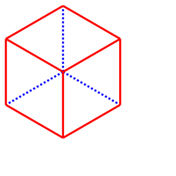

.. _importexport:

******************************
Importing and Exporting Files
******************************

Introduction
#############

The purpose of this section is to explain how to import external file formats into CadQuery, and export files from 
it as well. While the external file formats can be used to interchange CAD model data with other software, CadQuery 
does not support any formats that carry parametric data with them at this time. The only format that is fully 
parametric is CadQuery's own Python format. Below are lists of the import and export file formats that CadQuery 
supports.

Import Formats
---------------

* DXF
* STEP

Export Formats
---------------

* DXF
* SVG
* STEP
* STL
* AMF
* TJS
* VRML
* VTP

Notes on the Formats
---------------------

* DXF is useful for importing complex 2D profiles that would be tedious to create using CadQuery's 2D operations. An example is that the 2D profiles of aluminum extrusion are often provided in DXF format. These can be imported and extruded to create the length of extrusion that is needed in a design.
* STEP files are useful for interchanging model data with other CAD and analysis systems, such as FreeCAD. Many parts such as screws have STEP files available, which can be imported and used in CadQuery assemblies.
* STL and AMF files are mesh-based formats which are typically used in additive manufacturing (i.e. 3D printing). AMF files support more features, but are not as universally supported as STL files.
* TJS is short for ThreeJS, and is a JSON mesh format that is useful for displaying 3D models in web browsers. The TJS format is used to display embedded 3D examples within the CadQuery documentation.
* VRML is a mesh-based format for representing interactive 3D objects in a web browser.
* VTP is a mesh-based format used by the VTK library.

Importing DXF
##############

DXF files can be imported using the :py:meth:`importers.importDXF` method.

.. automethod::
    cadquery.importers.importDXF

Importing a DXF profile with default settings and using it within a CadQuery script is shown in the following code.

.. code-block:: python

    import cadquery as cq

    result = (
        cq.importers.importDXF('/path/to/dxf/circle.dxf')
        .wires().toPending()
        .extrude(10)
        )

Note the use of the :py:meth:`Workplane.wires` and :py:meth:`Workplane.toPending` methods to make the DXF profile 
ready for use during subsequent operations. Calling ``toPending()`` tells CadQuery to make the edges/wires available 
to the next modelling operation that is called in the chain.

Importing STEP
###############

STEP files can be imported using the :py:meth:`importers.importStep` method (note the capitalization of "Step"). 
There are no parameters for this method other than the file path to import.

.. code-block:: python

    import cadquery as cq

    result = cq.importers.importStep('/path/to/step/block.stp')

Exporting SVG
##############

The SVG exporter has several options which can be useful for achieving the desired final output. Those 
options are as follows.

* *width* - Document width of the resulting image.
* *height* - Document height of the resulting image.
* *marginLeft* - Inset margin from the left side of the document.
* *marginTop* - Inset margin from the top side of the document.
* *projectionDir* - Direction the camera will view the shape from.
* *showAxes* - Whether or not to show the axes indicator, which will only be visible when the projectionDir is also at the default.
* *strokeWidth* - Width of the line that visible edges are drawn with.
* *strokeColor* - Color of the line that visible edges are drawn with.
* *hiddenColor* - Color of the line that hidden edges are drawn with.
* *showHidden* - Whether or not to show hidden lines.

The options are passed to the exporter in a dictionary, and can be left out to force the SVG to be created with default options. 
Below are examples with and without options set.

Without options:

.. code-block:: python

    import cadquery as cq
    from cadquery import exporters

    result = cq.Workplane().box(10, 10, 10)

    exporters.export(result, '/path/to/file/box.svg')

Results in:

Note that the exporters API figured out the format type from the file extension. The format 
type can be set explicitly by using :py:class:`exporters.ExportTypes`.

The following is an example of using options to alter the resulting SVG output by passing in the ``opt`` parameter.

.. code-block:: python

    import cadquery as cq
    from cadquery import exporters

    result = cq.Workplane().box(10, 10, 10)

    exporters.export(
                result,
                '/path/to/file/box_custom_options.svg',
                opt={
                    "width": 300,
                    "height": 300,
                    "marginLeft": 10,
                    "marginTop": 10,
                    "showAxes": False,
                    "projectionDir": (0.5, 0.5, 0.5),
                    "strokeWidth": 0.25,
                    "strokeColor": (255, 0, 0),
                    "hiddenColor": (0, 0, 255),
                    "showHidden": True,
                },
            )

Which results in the following image:

Exporting STL
##############

The STL exporter is capable of adjusting the quality of the resulting mesh, and accepts the following parameters.

.. automethod::
    cadquery.occ_impl.shapes.Shape.exportStl

For more complex objects, some experimentation with ``tolerance`` and ``angularTolerance`` may be required to find the 
optimum values that will produce an acceptable mesh.

.. code-block:: python

    import cadquery as cq
    from cadquery import exporters

    result = cq.Workplane().box(10, 10, 10)

    exporters.export(result, '/path/to/file/mesh.stl')

Exporting AMF
##############

The AMF exporter is capable of adjusting the quality of the resulting mesh, and accepts the following parameters.

* ``fileName`` - The path and file name to write the AMF output to.
* ``tolerance`` - A linear deflection setting which limits the distance between a curve and its tessellation. Setting this value too low will result in large meshes that can consume computing resources. Setting the value too high can result in meshes with a level of detail that is too low. Default is 0.1, which is good starting point for a range of cases.
* ``angularTolerance`` - Angular deflection setting which limits the angle between subsequent segments in a polyline. Default is 0.1.

For more complex objects, some experimentation with ``tolerance`` and ``angularTolerance`` may be required to find the 
optimum values that will produce an acceptable mesh. Note that parameters for AMF color and material are absent.

.. code-block:: python

    import cadquery as cq
    from cadquery import exporters

    result = cq.Workplane().box(10, 10, 10)

    exporters.export(result, '/path/to/file/mesh.amf', tolerance=0.01, angularTolerance=0.1)

Exporting TJS
##############

The TJS (ThreeJS) exporter produces a file in JSON format that describes a scene for the ThreeJS WebGL renderer. The objects in the first argument are converted into a mesh and then form the ThreeJS geometry for the scene. The mesh can be adjusted with the following parameters.

* ``fileName`` - The path and file name to write the ThreeJS output to.
* ``tolerance`` - A linear deflection setting which limits the distance between a curve and its tessellation. Setting this value too low will result in large meshes that can consume computing resources. Setting the value too high can result in meshes with a level of detail that is too low. Default is 0.1, which is good starting point for a range of cases.
* ``angularTolerance`` - Angular deflection setting which limits the angle between subsequent segments in a polyline. Default is 0.1.

For more complex objects, some experimentation with ``tolerance`` and ``angularTolerance`` may be required to find the 
optimum values that will produce an acceptable mesh.

.. code-block:: python

    import cadquery as cq
    from cadquery import exporters

    result = cq.Workplane().box(10, 10, 10)

    exporters.export(result, '/path/to/file/mesh.json', tolerance=0.01, angularTolerance=0.1, exportType=exporters.ExportTypes.TJS)

Note that the export type was explicitly specified as ``TJS`` because the extension that was used for the file name was ``.json``. If the extension ``.tjs`` 
had been used, CadQuery would have understood to use the ``TJS`` export format.

Exporting VRML
###############

The VRML exporter is capable of adjusting the quality of the resulting mesh, and accepts the following parameters.

* ``fileName`` - The path and file name to write the VRML output to.
* ``tolerance`` - A linear deflection setting which limits the distance between a curve and its tessellation. Setting this value too low will result in large meshes that can consume computing resources. Setting the value too high can result in meshes with a level of detail that is too low. Default is 0.1, which is good starting point for a range of cases.
* ``angularTolerance`` - Angular deflection setting which limits the angle between subsequent segments in a polyline. Default is 0.1.

For more complex objects, some experimentation with ``tolerance`` and ``angularTolerance`` may be required to find the 
optimum values that will produce an acceptable mesh.

.. code-block:: python

    import cadquery as cq
    from cadquery import exporters

    result = cq.Workplane().box(10, 10, 10)

    exporters.export(result, '/path/to/file/mesh.vrml', tolerance=0.01, angularTolerance=0.1)

Exporting Other Formats
########################

The remaining export formats do not accept any additional parameters other than file name, and can be exported 
using the following structure.

.. code-block:: python

    import cadquery as cq
    from cadquery import exporters

    result = cq.Workplane().box(10, 10, 10)

    exporters.export(result, '/path/to/file/object.[file_extension]')

Be sure to use the correct file extension so that CadQuery can determine the export format. If in doubt, fall 
back to setting the type explicitly by using :py:class:`exporters.ExportTypes`.

For example:

.. code-block:: python

    import cadquery as cq
    from cadquery import exporters

    result = cq.Workplane().box(10, 10, 10)

    exporters.export(result, '/path/to/file/object.dxf', exporters.ExportTypes.DXF)
