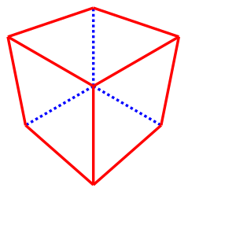

.. _importexport:
.. py:currentmodule:: cadquery

******************************
Importing and Exporting Files
******************************

Introduction
#############

The purpose of this section is to explain how to import external file formats into CadQuery, and export files from
it as well. While the external file formats can be used to interchange CAD model data with other software, CadQuery
does not support any formats that carry parametric data with them at this time. The only format that is fully
parametric is CadQuery's own Python format. Below are lists of the import and export file formats that CadQuery
supports.

Import Formats
---------------

* DXF
* STEP

Export Formats
---------------

* DXF
* SVG
* STEP
* STL
* AMF
* TJS
* VRML
* VTP
* 3MF
* glTF

Notes on the Formats
---------------------

* DXF is useful for importing complex 2D profiles that would be tedious to create using CadQuery's 2D operations. An example is that the 2D profiles of aluminum extrusion are often provided in DXF format. These can be imported and extruded to create the length of extrusion that is needed in a design.
* STEP files are useful for interchanging model data with other CAD and analysis systems, such as FreeCAD. Many parts such as screws have STEP files available, which can be imported and used in CadQuery assemblies.
* STL, AMF and 3MF files are mesh-based formats which are typically used in additive manufacturing (i.e. 3D printing). AMF and 3MF files support more features, but are not as universally supported as STL files.
* TJS is short for ThreeJS, and is a JSON mesh format that is useful for displaying 3D models in web browsers. The TJS format is used to display embedded 3D examples within the CadQuery documentation.
* VRML is a mesh-based format for representing interactive 3D objects in a web browser.
* VTP is a mesh-based format used by the VTK library.
* glTF is a mesh-based format useful for viewing models on the web. Whether the resulting glTF file is binary (.glb) or text (.gltf) is set by the file extension. This export format is only available for assemblies.

Importing DXF
##############

DXF files can be imported using the :meth:`importers.importDXF` method.

.. automethod::
    importers.importDXF

Importing a DXF profile with default settings and using it within a CadQuery script is shown in the following code.

.. code-block:: python

    import cadquery as cq

    result = (
        cq.importers.importDXF("/path/to/dxf/circle.dxf").wires().toPending().extrude(10)
    )

Note the use of the :meth:`Workplane.wires` and :meth:`Workplane.toPending` methods to make the DXF profile
ready for use during subsequent operations. Calling ``toPending()`` tells CadQuery to make the edges/wires available
to the next modelling operation that is called in the chain.

Importing STEP
###############

STEP files can be imported using the :meth:`importers.importStep` method (note the capitalization of "Step").
There are no parameters for this method other than the file path to import.

.. code-block:: python

    import cadquery as cq

    result = cq.importers.importStep("/path/to/step/block.stp")

Exporting STEP
###############

This section covers exporting CadQuery Workplane objects to STEP. For exporting assemblies to STEP, see the next section.

Default
--------

The exporters module handles exporting Workplane objects to STEP. It is not necessary to set the export type explicitly
since it will be determined from the file extension. Below is an example.

.. code-block:: python

    # Create a simple object
    box = cq.Workplane().box(10, 10, 10)

    # Export the box
    box.export("/path/to/step/box.step")

Non-Default File Extensions
----------------------------

If there is a requirement to export the STEP file using an "stp" extension, CadQuery will throw an error saying that it does
not recognize the file extension. In that case the export type has to be specified.

.. code-block:: python

    # Create a simple object
    box = cq.Workplane().box(10, 10, 10)

    # Export the box
    box.export("/path/to/step/box.stp", cq.exporters.ExportTypes.STEP)

    # The export type may also be specified as a literal
    box.export("/path/to/step/box2.stp", "STEP")

Setting Extra Options
----------------------

There are additional options that can be set when exporting an object to a STEP file.
For an explanation of the options available, see the documentation of the :meth:`Shape.exportStep` method
or the :meth:`Assembly.exportAssembly`` method.

.. code-block:: python

    # Create a simple object
    box = cq.Workplane().box(10, 10, 10)

    # Export the box, provide additional options with the opt dict
    box.export("/path/to/step/box.step", opt={"write_pcurves": False})

    # or equivalently when exporting a lower level Shape object
    box.val().export("/path/to/step/box2.step", opt={"write_pcurves": False})

Exporting Assemblies to STEP
#############################

It is possible to export CadQuery assemblies directly to STEP. The STEP exporter has multiple options which change the way
exported STEP files will appear and operate when opened in other CAD programs. All assembly export methods shown here will
preserve the color information from the assembly.

Default
--------

CadQuery assemblies have a :meth:`Assembly.export` method which can write an assembly to a STEP file. An example assembly
export with all defaults is shown below.

.. code-block:: python

    import cadquery as cq

    # Create a sample assembly
    assy = cq.Assembly()
    body = cq.Workplane().box(10, 10, 10)
    assy.add(body, color=cq.Color(1, 0, 0), name="body")
    pin = cq.Workplane().center(2, 2).cylinder(radius=2, height=20)
    assy.add(pin, color=cq.Color(0, 1, 0), name="pin")

    # Save the assembly to STEP
    assy.export("out.step")

This will produce a STEP file that is nested with auto-generated object names. The colors of each assembly object will be
preserved, but the names that were set for each will not.

Fused
------

The following will attempt to create a single, fused shape while preserving the name and color information of each assembly
object. The process of fusing the solid may cause performance issues in some cases, and is likely to alter the faces of the
fused solids.

.. code-block:: python

    import cadquery as cq

    # Create a sample assembly
    assy = cq.Assembly()
    body = cq.Workplane().box(10, 10, 10)
    assy.add(body, color=cq.Color(1, 0, 0), name="body")
    pin = cq.Workplane().center(2, 2).cylinder(radius=2, height=20)
    assy.add(pin, color=cq.Color(0, 1, 0), name="pin")

    # Save the assembly to STEP
    assy.export("out.stp", "STEP", mode="fused")

    # Specify additional options such as glue as keyword arguments
    assy.export("out_glue.step", mode="fused", glue=True, write_pcurves=False)

Naming
-------

It is also possible to set the name of the top level assembly object in the STEP file with either the DEFAULT or FUSED methods.
This is done by setting the name property of the assembly before calling :meth:`Assembly.export`.

.. code-block:: python

    assy = Assembly(name="my_assembly")
    assy.export(
        "out.stp",
        cq.exporters.ExportTypes.STEP,
        mode=cq.exporters.assembly.ExportModes.FUSED,
    )

If an assembly name is not specified, a UUID will be used to avoid name conflicts.

Exporting Assemblies to STEP with Metadata
###########################################

It is possible to attach metadata to the assembly that will be included in the STEP file. This metadata can be attached to arbitrary shapes and includes names, colors and layers. This is done by using the :meth:`Assembly.addSubshape` method before calling :meth:`cadquery.occ_impl.exporters.assembly.exportStepMeta`.

.. code-block:: python

    import cadquery as cq
    from cadquery.occ_impl.exporters.assembly import exportStepMeta

    # Create a simple assembly
    assy = cq.Assembly(name="top-level")
    cube_1 = cq.Workplane().box(10.0, 10.0, 10.0)
    assy.add(cube_1, name="cube_1", color=cq.Color("green"))

    # Add subshape name, color and layer
    assy.addSubshape(
        cube_1.faces(">Z").val(),
        name="cube_1_top_face",
        color=cq.Color("red"),
        layer="cube_1_top_face"
    )

    # Export the assembly to STEP with metadata
    exportStepMeta(assy, "out.step")

Exporting Assemblies to glTF
#############################

It is possible to export CadQuery assemblies to glTF format. glTF is a mesh-based format useful for viewing models on the web. Whether the resulting glTF file is binary (.glb) or text (.gltf) is set by the file extension.

CadQuery assemblies have a :meth:`Assembly.export` method which can write an assembly to a glTF file. An example assembly
export with all defaults is shown below. To export to a binary glTF file, change the extension to ``glb``.

.. code-block:: python

    import cadquery as cq

    # Create a sample assembly
    assy = cq.Assembly()
    body = cq.Workplane().box(10, 10, 10)
    assy.add(body, color=cq.Color(1, 0, 0), name="body")
    pin = cq.Workplane().center(2, 2).cylinder(radius=2, height=20)
    assy.add(pin, color=cq.Color(0, 1, 0), name="pin")

    # Save the assembly to GLTF
    assy.export("out.gltf")

Exporting SVG
###############

The SVG exporter has several options which can be useful for achieving the desired final output. Those
options are as follows.

* *width* - Width of the resulting image (None to fit based on height).
* *height* - Height of the resulting image (None to fit based on width).
* *marginLeft* - Inset margin from the left side of the document.
* *marginTop* - Inset margin from the top side of the document.
* *projectionDir* - Direction the camera will view the shape from.
* *showAxes* - Whether or not to show the axes indicator, which will only be visible when the projectionDir is also at the default.
* *strokeWidth* - Width of the line that visible edges are drawn with.
* *strokeColor* - Color of the line that visible edges are drawn with.
* *hiddenColor* - Color of the line that hidden edges are drawn with.
* *showHidden* - Whether or not to show hidden lines.
* *focus* - If specified, creates a perspective SVG with the projector at the distance specified.

The options are passed to the exporter in a dictionary, and can be left out to force the SVG to be created with default options.
Below are examples with and without options set.

Without options:

.. code-block:: python

    import cadquery as cq
    from cadquery import exporters

    result = cq.Workplane().box(10, 10, 10)

    result.export("/path/to/file/box.svg")

Results in:

..  image:: _static/importexport/box_default_options.svg

Note that the exporters API figured out the format type from the file extension. The format
type can be set explicitly by using :py:class:`exporters.ExportTypes`.

The following is an example of using options to alter the resulting SVG output by passing in the ``opt`` parameter.

.. code-block:: python

    import cadquery as cq
    from cadquery import exporters

    result = cq.Workplane().box(10, 10, 10)

    result.export(
        "/path/to/file/box_custom_options.svg",
        opt={
            "width": 300,
            "height": 300,
            "marginLeft": 10,
            "marginTop": 10,
            "showAxes": False,
            "projectionDir": (0.5, 0.5, 0.5),
            "strokeWidth": 0.25,
            "strokeColor": (255, 0, 0),
            "hiddenColor": (0, 0, 255),
            "showHidden": True,
        },
    )

Which results in the following image:

..  image:: _static/importexport/box_custom_options.svg

Exporting with the additional option ``"focus": 25`` results in the following output SVG with perspective:

Exporting STL
##############

The STL exporter is capable of adjusting the quality of the resulting mesh, and accepts the following parameters.

.. automethod::
    cadquery.occ_impl.shapes.Shape.exportStl

For more complex objects, some experimentation with ``tolerance`` and ``angularTolerance`` may be required to find the
optimum values that will produce an acceptable mesh.

.. code-block:: python

    import cadquery as cq
    from cadquery import exporters

    result = cq.Workplane().box(10, 10, 10)

    result.export("/path/to/file/mesh.stl")

Exporting AMF and 3MF
######################

The AMF and 3MF exporters are capable of adjusting the quality of the resulting mesh, and accept the following parameters.

* ``fileName`` - The path and file name to write the AMF output to.
* ``tolerance`` - A linear deflection setting which limits the distance between a curve and its tessellation. Setting this value too low will result in large meshes that can consume computing resources. Setting the value too high can result in meshes with a level of detail that is too low. Default is 0.1, which is good starting point for a range of cases.
* ``angularTolerance`` - Angular deflection setting which limits the angle between subsequent segments in a polyline. Default is 0.1.

For more complex objects, some experimentation with ``tolerance`` and ``angularTolerance`` may be required to find the
optimum values that will produce an acceptable mesh. Note that parameters for color and material are absent.

.. code-block:: python

    import cadquery as cq
    from cadquery import exporters

    result = cq.Workplane().box(10, 10, 10)

    result.export("/path/to/file/mesh.amf", tolerance=0.01, angularTolerance=0.1)

Exporting TJS
##############

The TJS (ThreeJS) exporter produces a file in JSON format that describes a scene for the ThreeJS WebGL renderer. The objects in the first argument are converted into a mesh and then form the ThreeJS geometry for the scene. The mesh can be adjusted with the following parameters.

* ``fileName`` - The path and file name to write the ThreeJS output to.
* ``tolerance`` - A linear deflection setting which limits the distance between a curve and its tessellation. Setting this value too low will result in large meshes that can consume computing resources. Setting the value too high can result in meshes with a level of detail that is too low. Default is 0.1, which is good starting point for a range of cases.
* ``angularTolerance`` - Angular deflection setting which limits the angle between subsequent segments in a polyline. Default is 0.1.

For more complex objects, some experimentation with ``tolerance`` and ``angularTolerance`` may be required to find the
optimum values that will produce an acceptable mesh.

.. code-block:: python

    import cadquery as cq
    from cadquery import exporters

    result = cq.Workplane().box(10, 10, 10)

    result.export(
        "/path/to/file/mesh.json",
        tolerance=0.01,
        angularTolerance=0.1,
        exportType=exporters.ExportTypes.TJS,
    )

Note that the export type was explicitly specified as ``TJS`` because the extension that was used for the file name was ``.json``. If the extension ``.tjs``
had been used, CadQuery would have understood to use the ``TJS`` export format.

Exporting VRML
###############

The VRML exporter is capable of adjusting the quality of the resulting mesh, and accepts the following parameters.

* ``fileName`` - The path and file name to write the VRML output to.
* ``tolerance`` - A linear deflection setting which limits the distance between a curve and its tessellation. Setting this value too low will result in large meshes that can consume computing resources. Setting the value too high can result in meshes with a level of detail that is too low. Default is 0.1, which is good starting point for a range of cases.
* ``angularTolerance`` - Angular deflection setting which limits the angle between subsequent segments in a polyline. Default is 0.1.

For more complex objects, some experimentation with ``tolerance`` and ``angularTolerance`` may be required to find the
optimum values that will produce an acceptable mesh.

.. code-block:: python

    import cadquery as cq
    from cadquery import exporters

    result = cq.Workplane().box(10, 10, 10)

    result.export(
        "/path/to/file/mesh.vrml", tolerance=0.01, angularTolerance=0.1
    )

Exporting DXF
##############

.. warning:: DXF exporting works only with 2D sections on the current workplane or sketches.

.. seealso::

    :class:`cadquery.occ_impl.exporters.dxf.DxfDocument` for exporting multiple
    Workplanes to one or many layers of a DXF document.

Options
-------

``approx``
    Approximation strategy for converting :class:`cadquery.Workplane` objects to DXF entities:

        ``None``
            no approximation applied
        ``"spline"``
            all splines approximated as cubic splines
        ``"arc"``
            all curves approximated as arcs and straight segments
``tolerance``
    Approximation tolerance for converting :class:`cadquery.Workplane` objects to DXF entities.
    See `Approximation strategy`_.
``doc_units``
    Ezdxf document/modelspace :doc:`units <ezdxf-stable:concepts/units>`.
    See `Units`_.

.. code-block:: python
    :caption: DXF of workplanes.

    import cadquery as cq

    result = cq.Workplane().box(10, 10, 10).section()

    exporters.exportDXF(result, "/path/to/file/object.dxf")
    # or
    result.export("/path/to/file/object.dxf")

Sketches can also be directly exported to DXF.

.. code-block:: python
    :caption: DXF export of sketches.

    import cadquery as cq

    result = cq.Sketch().rect(1,1)

    result.export("/path/to/file/object.dxf")

Units
-----

The default DXF document units are mm (:code:`doc_units = 4`).

========= ===============
doc_units Unit
========= ===============
0         Unitless
1         Inches
2         Feet
3         Miles
4         Millimeters
5         Centimeters
6         Meters
========= ===============

Document units can be set to any :doc:`unit supported by ezdxf <ezdxf-stable:concepts/units>`.

.. code-block:: python
    :caption: DXF document with units set to meters.

    import cadquery as cq
    from cadquery import exporters

    result = cq.Workplane().box(10, 10, 10).section()

    exporters.exportDXF(
        result,
        "/path/to/file/object.dxf",
        doc_units=6,  # set DXF document units to meters
    )

    # or

    result.export(
        "/path/to/file/object.dxf",
        opt={"doc_units": 6},  # set DXF document units to meters
    )

.. _Approximation strategy:

Approximation strategy
----------------------

By default, the DXF exporter will output splines exactly as they are represented by the OpenCascade kernel. Unfortunately some software cannot handle higher-order splines resulting in missing curves after DXF import. To resolve this, specify an approximation strategy controlled by the following options:

* ``approx`` - ``None``, ``"spline"`` or ``"arc"``. ``"spline"`` results in all splines approximated with cubic splines. ``"arc"`` results in all curves approximated with arcs and line segments.
* ``tolerance``: Acceptable error of the approximation, in document/modelspace units. Defaults to 0.001 (1 thou for inch-scale drawings, 1 µm for mm-scale drawings).

.. code-block:: python
    :caption: DXF document with curves approximated with cubic splines.

    cq.exporters.exportDXF(result, "/path/to/file/object.dxf", approx="spline")

Exporting Other Formats
########################

The remaining export formats do not accept any additional parameters other than file name, and can be exported
using the following structure.

.. code-block:: python

    import cadquery as cq
    from cadquery import exporters

    result = cq.Workplane().box(10, 10, 10)

    result.export("/path/to/file/object.[file_extension]")

Be sure to use the correct file extension so that CadQuery can determine the export format. If in doubt, fall
back to setting the type explicitly by using :py:class:`exporters.ExportTypes`.

For example:

.. code-block:: python

    import cadquery as cq
    from cadquery import exporters

    result = cq.Workplane().box(10, 10, 10).section()

    result.export("/path/to/file/object.dxf", exporters.ExportTypes.DXF)
