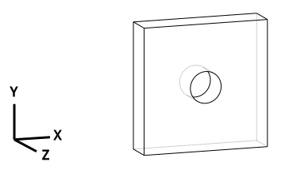
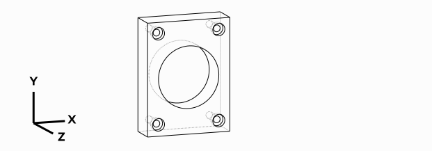

.. _what_is_cadquery:

*********************
Introduction
*********************

What is CadQuery
========================================

CadQuery is an intuitive, easy-to-use Python library for building parametric 3D CAD models.  It has several goals:

    * Build models with scripts that are as close as possible to how you'd describe the object to a human,
      using a standard, already established programming language

    * Create parametric models that can be very easily customized by end users

    * Output high quality CAD formats like STEP and AMF in addition to traditional STL

    * Provide a non-proprietary, plain text model format that can be edited and executed with only a web browser

CadQuery 2 is based on
`OCP <https://github.com/CadQuery/OCP>`_,
which is a set of Python bindings for the open-source `OpenCascade <http://www.opencascade.com/>`_ modelling kernel.

Using CadQuery, you can build fully parametric models with a very small amount of code. For example, this simple script
produces a flat plate with a hole in the middle::

    thickness = 0.5
    width=2.0
    result = Workplane("front").box(width,width,thickness).faces(">Z").hole(thickness)

That's a bit of a dixie-cup example. But it is pretty similar to a more useful part: a parametric pillow block for a
standard 608-size ball bearing::

    (length,height,diam, thickness,padding) = ( 30.0,40.0,22.0,10.0,8.0)

    result = Workplane("XY").box(length,height,thickness).faces(">Z").workplane().hole(diam)\
            .faces(">Z").workplane() \
            .rect(length-padding,height-padding,forConstruction=True) \
            .vertices().cboreHole(2.4,4.4,2.1)

Lots more examples are available in the :ref:`examples`

CadQuery is a library,  GUIs are separate
==============================================

CadQuery is a library, that's intentionally designed to be usable as a GUI-less library. This enables
its use in a variety of engineering and scientific applications that create 3D models programmatically.

If you'd like a GUI, you have a couple of options:

   * The Qt-based GUI `CQ-editor <https://github.com/CadQuery/CQ-editor>`_
   * As an Jupyter extension `jupyter-cadquery <https://github.com/bernhard-42/jupyter-cadquery>`_

Why CadQuery instead of OpenSCAD?
============================================

Like OpenSCAD, CadQuery is an open-source, script based, parametric model generator. But CadQuery has several key advantages:

    1. **The scripts use a standard programming language**, Python, and thus can benefit from the associated infrastructure.
       This includes many standard libraries and IDEs

    2. **More powerful CAD kernel** OpenCascade is much more powerful than CGAL. Features supported natively
       by OCC include NURBS, splines, surface sewing, STL repair, STEP import/export,  and other complex operations,
       in addition to the standard CSG operations supported by CGAL

    3. **Ability to import/export STEP and DXF** We think the ability to begin with a STEP model, created in a CAD package,
       and then add parametric features is key.  This is possible in OpenSCAD using STL, but STL is a lossy format

    4. **Less Code and easier scripting**  CadQuery scripts require less code to create most objects, because it is possible to locate
       features based on the position of other features, workplanes, vertices, etc.

    5. **Better Performance**  CadQuery scripts can build STL, STEP, and AMF faster than OpenSCAD.

Where does the name CadQuery come from?
========================================

CadQuery is inspired by `jQuery <http://www.jquery.com>`_, a popular framework that
revolutionized web development involving JavaScript.

CadQuery is for 3D CAD what jQuery is for JavaScript.
If you are familiar with how jQuery works, you will probably recognize several jQuery features that CadQuery uses:

    * A fluent API to create clean, easy to read code

    * Ability to use the library along side other Python libraries

    * Clear and complete documentation, with plenty of samples.

