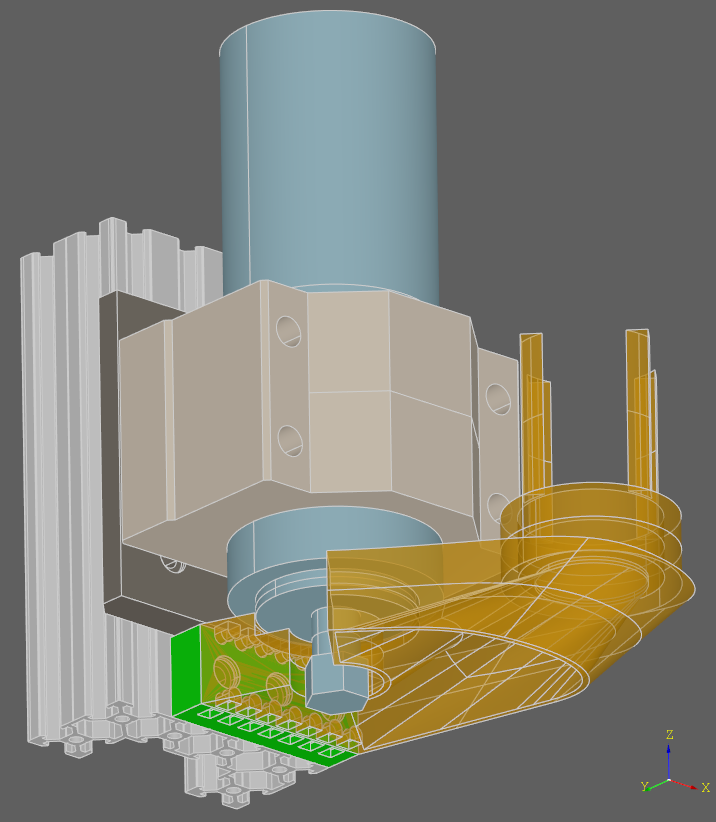

.. _3d_cad_primer:

.. _cadquery_concepts:

CadQuery Concepts
===================================

3D BREP Topology Concepts
---------------------------
Before talking about CadQuery, it makes sense to talk a little about 3D CAD topology. CadQuery is based upon the
OpenCascade kernel, which uses Boundary Representations (BREP) for objects.  This just means that objects
are defined by their enclosing surfaces.

When working in a BREP system, these fundamental constructs exist to define a shape (working up the food chain):

   :vertex: a single point in space
   :edge: a connection between two or more vertices along a particular path (called a curve)
   :wire: a collection of edges that are connected together.
   :face: a set of edges or wires that enclose a surface
   :shell: a collection of faces that are connected together along some of their edges
   :solid: a shell that has a closed interior
   :compound: a collection of solids

When using CadQuery, all of these objects are created, hopefully with the least possible work. In the actual CAD
kernel, there is another set of Geometrical constructs involved as well. For example, an arc-shaped edge will
hold a reference to an underlying curve that is a full circle, and each linear edge holds underneath it the equation
for a line.  CadQuery shields you from these constructs.

Workplane class
---------------------------

The Workplane class contains the currently selected objects (a list of Shapes, Vectors or Locations
in the :attr:`~cadquery.Workplane.objects` attribute), the modelling context (in the
:attr:`~cadquery.Workplane.ctx` attribute), and CadQuery's fluent api methods. It is the main class
that users will instantiate.

See :ref:`apireference` to learn more.

Workplanes
---------------------------

Most CAD programs use the concept of Workplanes. If you have experience with other CAD programs you will probably 
feel comfortable with CadQuery's Workplanes, but if you don't have experience then they are an essential concept to 
understand. 

Workplanes represent a plane in space, from which other features can be located. They have a center point and a local 
coordinate system. Most methods that create an object do so relative to the current workplane.

Usually the first workplane created is the "XY" plane, also known as the "front" plane. Once a solid is defined the most 
common way to create a workplane is to select a face on the solid that you intend to modify and create a new workplane 
relative to it. You can also create new workplanes in anywhere in world coordinate system, or relative to other planes 
using offsets or rotations.

The most powerful feature of workplanes is that they allow you to work in 2D space in the coordinate system of the
workplane, and then CadQuery will transform these points from the workplane coordinate system to the world coordinate 
system so your 3D features are located where you intended. This makes scripts much easier to create and maintain.

See :py:class:`cadquery.Workplane` to learn more.

2D Construction
---------------------------

Once you create a workplane, you can work in 2D, and then later use the features you create to make 3D objects.
You'll find all of the 2D constructs you expect -- circles, lines, arcs, mirroring, points, etc.

See :ref:`2dOperations` to learn more.

3D Construction
---------------------------

You can construct 3D primitives such as boxes, wedges, cylinders and spheres directly. You can also sweep, extrude,
and loft 2D geometry to form 3D features.  Of course the basic primitive operations are also available.

See :ref:`3doperations` to learn more.

Selectors
---------------------------

Selectors allow you to select one or more features, in order to define new features.  As an example, you might
extrude a box, and then select the top face as the location for a new feature.  Or, you might extrude a box, and
then select all of the vertical edges so that you can apply a fillet to them.

You can select Vertices, Edges, Faces, Solids, and Wires using selectors.

Think of selectors as the equivalent of your hand and mouse, if you were to build an object using a conventional CAD system.

See :ref:`selectors` to learn more.

Construction Geometry
---------------------------
Construction geometry are features that are not part of the object, but are only defined to aid in building the object.
A common example might be to define a rectangle, and then use the corners to define the location of a set of holes.

Most CadQuery construction methods provide a ``forConstruction`` keyword, which creates a feature that will only be used
to locate other features.

The Stack
---------------------------

As you work in CadQuery, each operation returns a new Workplane object with the result of that
operations. Each Workplane object has a list of objects, and a reference to its parent.

You can always go backwards to older operations by removing the current object from the stack.  For example::

    Workplane(someObject).faces(">Z").first().vertices()

returns a CadQuery object that contains all of the vertices on the highest face of someObject. But you can always move
backwards in the stack to get the face as well::

    Workplane(someObject).faces(">Z").first().vertices().end()

You can browse stack access methods here: :ref:`stackMethods`.

.. _chaining:

Chaining
---------------------------

All Workplane methods return another Workplane object, so that you can chain the methods together
fluently. Use the core Workplane methods to get at the objects that were created.

Each time a new Workplane object is produced during these chained calls, it has a
:attr:`~cadquery.Workplane.parent` attribute that points to the Workplane object that created it.
Several CadQuery methods search this parent chain, for example when searching for the context solid.
You can also give a Workplane object a tag, and further down your chain of calls you can refer back
to this particular object using its tag.

The Context Solid
---------------------------

Most of the time, you are building a single object, and adding features to that single object.  CadQuery watches
your operations, and defines the first solid object created as the 'context solid'.  After that, any features
you create are automatically combined (unless you specify otherwise) with that solid.  This happens even if the
solid was created  a long way up in the stack.  For example::

    Workplane('XY').box(1,2,3).faces(">Z").circle(0.25).extrude()

Will create a 1x2x3 box, with a cylindrical boss extending from the top face.  It was not necessary to manually
combine the cylinder created by extruding the circle with the box, because the default behavior for extrude is
to combine the result with the context solid. The hole() method works similarly -- CadQuery presumes that you want
to subtract the hole from the context solid.

If you want to avoid this, you can specify ``combine=False``, and CadQuery will create the solid separately.

Iteration
---------------------------

CAD models often have repeated geometry, and its really annoying to resort to for loops to construct features.
Many CadQuery methods operate automatically on each element on the stack, so that you don't have to write loops.
For example, this::

    Workplane('XY').box(1,2,3).faces(">Z").vertices().circle(0.5)

Will actually create 4 circles, because ``vertices()`` selects 4 vertices of a rectangular face, and the ``circle()`` method
iterates on each member of the stack.

This is really useful to remember  when you author your own plugins. :py:meth:`cadquery.cq.Workplane.each` is useful for this purpose.

CadQuery API layers
---------------------------

Once you start to dive a bit more into CadQuery, you may find yourself a bit confused juggling between different types of objects the CadQuery APIs can return.
This chapter aims to give an explanation on this topic and to provide background on the underlying implementation and kernel layers so you can leverage more of CadQuery functionality.

CadQuery is composed of 3 different API, which are implemented on top of each other.

1. The Fluent API 
2. The Direct API 
3. The OCCT API 

The Fluent API
~~~~~~~~~~~~~~~~~~~~~~

What we call the fluent API is what you work with when you first start using CadQuery, the :class:`~cadquery.Workplane` class and all its methods defines the Fluent API.
This is the API you will use and see most of the time, it's fairly easy to use and it simplifies a lot of things for you. A classic example could be : ::

    part = Workplane('XY').box(1,2,3).faces(">Z").vertices().circle(0.5).cutThruAll()

Here we create a :class:`~cadquery.Workplane` object on which we subsequently call several methods to create our part. A general way of thinking about the Fluent API is to 
consider the :class:`~cadquery.Workplane` as your part object and all it's methods as operations that will affect your part.
Often you will start with an empty :class:`~cadquery.Workplane`, then add more features by calling :class:`~cadquery.Workplane` methods.

This hierarchical structure of operations modifying a part is well seen with the traditional code style used in CadQuery code. 
Code written with the CadQuery fluent API will often look like this : ::

    part = (Workplane('XY')
            .box(1,2,3)
            .faces(">Z")
            .vertices()
            .circle(0.5)
            .cutThruAll()
            )

Or like this : ::

    part = Workplane('XY')
    part = part.box(1,2,3)
    part = part.faces(">Z")
    part = part.vertices()
    part = part.circle(0.5)
    part = part.cutThruAll()

.. note::
  While the first code style is what people default to, it's important to note that when you write your code like this it's equivalent as writting it on a single line.
  It's then more difficult to debug as you cannot visualize each operation step by step, which is a functionality that is provided by the CQ-Editor debugger for example.

The Direct API
~~~~~~~~~~~~~~~~~~~~~~

While the fluent API exposes much functionality, you may find scenarios that require extra flexibility or require working with lower level objects.

The direct API is the API that is called by the fluent API under the hood. The 9 topological classes and their methods compose the direct API.
These classes actually wrap the equivalent Open CASCADE Technology (OCCT) classes.
The 9 topological classes are :

1. :class:`~cadquery.Shape`
2. :class:`~cadquery.Compound`
3. :class:`~cadquery.CompSolid`
4. :class:`~cadquery.Solid`
5. :class:`~cadquery.Shell`
6. :class:`~cadquery.Face`
7. :class:`~cadquery.Wire`
8. :class:`~cadquery.Edge`
9. :class:`~cadquery.Vertex`

Each class has its own methods to create and/or edit shapes of their respective type. As already explained in :ref:`cadquery_concepts` there is also some kind of hierarchy in the 
topological classes. A Wire is made of several edges which are themselves made of several vertices. This means you can create geometry from the bottom up and have a lot of control over it.

For example we can create a circular face like so ::

  circle_wire = Wire.makeCircle(10,Vector(0,0,0), Vector(0,0,1))
  circular_face = Face.makeFromWires(circle_wire, [])

.. note::
  In CadQuery (and OCCT) all the topological classes are shapes, the :class:`~cadquery.Shape` class is the most abstract topological class. 
  The topological class inherits :class:`~cadquery.Mixin3D` or :class:`~cadquery.Mixin1D` which provide aditional methods that are shared between the classes that inherits them.

The direct API as its name suggests doesn't provide a parent/children data structure, instead each method call directly returns an object of the specified topological type.
It is more verbose than the fluent API and more tedious to work with, but as it offers more flexibility (you can work with faces, which is something you can't do in the fluent API)
it is sometimes more convenient than the fluent API.

The OCCT API
~~~~~~~~~~~~~~~~~~~~~~

Finally we are discussing about the OCCT API. The OCCT API is the lowest level of CadQuery. The direct API is built upon the OCCT API, where the OCCT API in CadQuery is available through OCP.
OCP are the Python bindings of the OCCT C++ libraries CadQuery uses. This means you have access to (almost) all the OCCT C++ libraries in Python and in CadQuery.
Working with the OCCT API will give you the maximum flexibility and control over you designs, it is however very verbose and difficult to use. You will need to have a strong 
knowledge of the different C++ libraries to be able to achieve what you want. To obtain this knowledge the most obvious ways are :

1. Read the direct API source code, since it is build upon the OCCT API it is full of example usage.
2. Go through the `C++ documentation <https://dev.opencascade.org/doc/overview/html/>`_

.. note::
  The general way of importing a specific class of the OCCT API is ::

    from OCP.thePackageName import theClassName

  For example if you want to use the class `BRepPrimAPI_MakeBox <https://dev.opencascade.org/doc/refman/html/class_b_rep_prim_a_p_i___make_box.html>`_.
  You will go by the following ::

    from OCP.BRepPrimAPI import BRepPrimAPI_MakeBox

  The package name of any class is written at the top of the documentation page. Often it's written in the class name itself as a prefix.

Going back and forth between the APIs
~~~~~~~~~~~~~~~~~~~~~~~~~~~~~~~~~~~~~

While the 3 APIs provide 3 different layer of complexity and functionality you can mix the 3 layers as you wish.
Below is presented the different ways you can interact with the different API layers.

-------------------------
Fluent API <=> Direct API
-------------------------

Here are all the possibilities you have to get an object from the Direct API (i.e a topological object).

You can end the Fluent API call chain and get the last object on the stack with :py:meth:`Workplane.val` alternatively you can get all 
the objects with :py:meth:`Workplane.vals` ::

  box = Workplane().box(10,5,5)
  print(type(box))
  >>> <class cadquery.cq.Workplane>

  box = Workplane().box(10,5,5).val()
  print(type(box))
  >>> <class cadquery.occ_impl.shapes.Solid> 

If you are only interested in getting the context solid of your Workplane, you can use :py:meth:`Workplane.findSolid`::

  part = Workplane().box(10,5,5).circle(3).val()
  print(type(part))
  >>> <class cadquery.cq.Wire>

  part = Workplane().box(10,5,5).circle(3).findSolid()
  print(type(part))
  >>> <class cadquery.occ_impl.shapes.Compound> 
  # The return type of findSolid is either a Solid or a Compound object 

If you want to go the other way around i.e using objects from the topological API in the Fluent API here are your options :

You can pass a topological object as a base object to the :class:`~cadquery.Workplane` object. ::

  solid_box = Solid.makeBox(10,10,10)
  part = Workplane(obj = solid_box) 
  # And you can continue your modelling in the fluent API 
  part = part.faces(">Z").circle(1).extrude(10)

You can add a topological object as a new operation/step in the Fluent API call chain with :py:meth:`Workplane.newObject` ::
   
  circle_wire = Wire.makeCircle(1,Vector(0,0,0), Vector(0,0,1))
  box = Workplane().box(10,10,10).newObject([circle_wire])
  # And you can continue modelling 
  box = box.toPending().cutThruAll() # notice the call to `toPending` that is needed if you want to use it in a subsequent operation

-------------------------
Direct API <=> OCCT API
-------------------------

Every object of the Direct API stores its OCCT equivalent object in its :attr:`wrapped` attribute. ::

  box = Solid.makeBox(10,5,5)
  print(type(box))
  >>> <class cadquery.occ_impl.shapes.Solid> 

  box = Solid.makeBox(10,5,5).wrapped
  print(type(box))
  >>> <class OCP.TopoDS.TopoDS_Solid> 

If you want to cast an OCCT object into a Direct API one you can just pass it as a parameter of the intended class ::

  occt_box = BRepPrimAPI_MakeBox(5,5,5).Solid()
  print(type(occt_box))
  >>> <class OCP.TopoDS.TopoDS_Solid> 

  direct_api_box = Solid(occt_box)
  print(type(direct_api_box))
  >>> <class cadquery.occ_impl.shapes.Solid> 

.. note::
  You can cast into the direct API the types found `here <https://dev.opencascade.org/doc/refman/html/class_topo_d_s___shape.html>`_

Multimethods
------------

CadQuery uses `Multimethod <https://coady.github.io/multimethod/>`_ to allow a call to a method to
be dispatched depending on the types of the arguments. An example is :meth:`~cadquery.Sketch.arc`,
where ``a_sketch.arc((1, 2), (2, 3))`` would be dispatched to one method but ``a_sketch.arc((1, 2),
(2, 3), (3, 4))`` would be dispatched to a different method. For multimethods to work, you should
not use keyword arguments to specify positional parameters. For example, you **should not** write
``a_sketch.arc(p1=(1, 2), p2=(2, 3), p3=(3, 4))``, instead you should use the previous example.
Note CadQuery makes an attempt to fall back on the first registered multimethod in the event of a
dispatch error, but it is still best practise to not use keyword arguments to specify positional
arguments in CadQuery.

An Introspective Example
------------------------

.. note::
    If you are just beginning with CadQuery then you can leave this example for later.  If you have
    some experience with creating CadQuery models and now you want to read the CadQuery source to
    better understand what your code does, then it is recommended you read this example first.

To demonstrate the above concepts, we can define more detailed string representations for the
:class:`~cadquery.Workplane`, :class:`~cadquery.Plane` and :class:`~cadquery.CQContext` classes and
patch them in::

    import cadquery as cq

    def tidy_repr(obj):
        """ Shortens a default repr string
        """
        return repr(obj).split('.')[-1].rstrip('>')

    def _ctx_str(self):
        return (
            tidy_repr(self) + ":\n"
            + f"    pendingWires: {self.pendingWires}\n"
            + f"    pendingEdges: {self.pendingEdges}\n"
            + f"    tags: {self.tags}"
        )

    cq.cq.CQContext.__str__ = _ctx_str

    def _plane_str(self):
        return (
            tidy_repr(self) + ":\n"
            + f"    origin: {self.origin.toTuple()}\n"
            + f"    z direction: {self.zDir.toTuple()}"
        )

    cq.occ_impl.geom.Plane.__str__ = _plane_str

    def _wp_str(self):
        out = tidy_repr(self) + ":\n"
        out += f"  parent: {tidy_repr(self.parent)}\n" if self.parent else "  no parent\n"
        out += f"  plane: {self.plane}\n"
        out += f"  objects: {self.objects}\n"
        out += f"  modelling context: {self.ctx}"
        return out

    cq.Workplane.__str__ = _wp_str

Now we can make a simple part and examine the :class:`~cadquery.Workplane` and
:class:`~cadquery.cq.CQContext` objects at each step. The final part looks like:

.. cadquery::
    :select: part

    part = (
        cq.Workplane()
        .box(1, 1, 1)
        .tag("base")
        .wires(">Z")
        .toPending()
        .translate((0.1, 0.1, 1.0))
        .toPending()
        .loft()
        .faces(">>X", tag="base")
        .workplane(centerOption="CenterOfMass")
        .circle(0.2)
        .extrude(1)
    )

.. note::
    Some of the modelling process for this part is a bit contrived and not a great example of fluent
    CadQuery techniques.

The start of our chain of calls is::

    part = cq.Workplane()
    print(part)

Which produces the output:

.. code-block:: none

    Workplane object at 0x2760:
      no parent
      plane: Plane object at 0x2850:
        origin: (0.0, 0.0, 0.0)
        z direction: (0.0, 0.0, 1.0)
      objects: []
      modelling context: CQContext object at 0x2730:
        pendingWires: []
        pendingEdges: []
        tags: {}

This is simply an empty :class:`~cadquery.Workplane`. Being the first :class:`~cadquery.Workplane`
in the chain, it does not have a parent. The :attr:`~cadquery.Workplane.plane` attribute contains a
:class:`~cadquery.Plane` object that describes the XY plane.

Now we create a simple box. To keep things short, the ``print(part)`` line will not be shown for the
rest of these code blocks::

    part = part.box(1, 1, 1)

Which produces the output:

.. code-block:: none

    Workplane object at 0xaa90:
      parent: Workplane object at 0x2760
      plane: Plane object at 0x3850:
        origin: (0.0, 0.0, 0.0)
        z direction: (0.0, 0.0, 1.0)
      objects: [<cadquery.occ_impl.shapes.Solid object at 0xbbe0>]
      modelling context: CQContext object at 0x2730:
        pendingWires: []
        pendingEdges: []
        tags: {}

The first thing to note is that this is a different :class:`~cadquery.Workplane` object to the
previous one, and in the :attr:`~cadquery.Workplane.parent` attribute of this
:class:`~cadquery.Workplane` is our previous :class:`~cadquery.Workplane`. Returning a new instance
of :class:`~cadquery.Workplane` is the normal behaviour of most :class:`~cadquery.Workplane` methods
(with some exceptions, as will be shown below) and this is how the `chaining`_ concept is
implemented.

Secondly, the modelling context object is the same as the one in the previous
:class:`~cadquery.Workplane`, and this one modelling context at ``0x2730`` will be shared between
every :class:`Workplane` object in this chain. If we instantiate a new :class:`~cadquery.Workplane`
with ``part2 = cq.Workplane()``, then this ``part2`` would have a different instance of the
:class:`~cadquery.cq.CQContext` attached to it.

Thirdly, in our objects list is a single :class:`~cadquery.Solid` object, which is the box we just
created.

Often when creating models you will find yourself wanting to refer back to a specific
:class:`~cadquery.Workplane` object, perhaps because it is easier to select the feature you want in this
earlier state, or because you want to reuse a plane. Tags offer a way to refer back to a previous
:class:`~cadquery.Workplane`. We can tag the :class:`~cadquery.Workplane` that contains this basic box now::

    part = part.tag("base")

The string representation of ``part`` is now:

.. code-block:: none

    Workplane object at 0xaa90:
      parent: Workplane object at 0x2760
      plane: Plane object at 0x3850:
        origin: (0.0, 0.0, 0.0)
        z direction: (0.0, 0.0, 1.0)
      objects: [<cadquery.occ_impl.shapes.Solid object at 0xbbe0>]
      modelling context: CQContext object at 0x2730:
        pendingWires: []
        pendingEdges: []
        tags: {'base': <cadquery.cq.Workplane object at 0xaa90>}

The :attr:`~cadquery.cq.CQContext.tags` attribute of the modelling context is simply a dict
associating the string name given by the :meth:`~cadquery.Workplane.tag` method to the
:class:`~cadquery.Workplane`. Methods such as :meth:`~cadquery.Workplane.workplaneFromTagged` and
selection methods like :meth:`~cadquery.Workplane.edges` can operate on a tagged
:class:`~cadquery.Workplane`. Note that unlike the ``part = part.box(1, 1, 1)`` step where we went
from ``Workplane object at 0x2760`` to ``Workplane object at 0xaa90``, the
:meth:`~cadquery.Workplane.tag` method has returned the same object at ``0xaa90``. This is unusual
for a :class:`~cadquery.Workplane` method.

The next step is::

    part = part.faces(">>Z")

The output is:

.. code-block:: none

    Workplane object at 0x8c40:
      parent: Workplane object at 0xaa90
      plane: Plane object at 0xac40:
        origin: (0.0, 0.0, 0.0)
        z direction: (0.0, 0.0, 1.0)
      objects: [<cadquery.occ_impl.shapes.Face object at 0x3c10>]
      modelling context: CQContext object at 0x2730:
        pendingWires: []
        pendingEdges: []
        tags: {'base': <cadquery.cq.Workplane object at 0xaa90>}

Our selection method has taken the :class:`~cadquery.Solid` from the
:attr:`~cadquery.Workplane.objects` list of the previous :class:`~cadquery.Workplane`, found the
face with it's center furthest in the Z direction, and placed that face into the
:attr:`~cadquery.Workplane.objects` attribute. The :class:`~cadquery.Solid` representing the box we
are modelling is gone, and when a :class:`~cadquery.Workplane` method needs to access that solid it
searches through the parent chain for the nearest solid. This action can also be done by a user
through the :meth:`~cadquery.Workplane.findSolid` method.

Now we want to select the boundary of this :class:`~cadquery.Face` (a :class:`~cadquery.Wire`), so
we use::

    part = part.wires()

The output is now:

.. code-block:: none

    Workplane object at 0x6880:
      parent: Workplane object at 0x8c40
      plane: Plane object at 0x38b0:
        origin: (0.0, 0.0, 0.0)
        z direction: (0.0, 0.0, 1.0)
      objects: [<cadquery.occ_impl.shapes.Wire object at 0xaca0>]
      modelling context: CQContext object at 0x2730:
        pendingWires: []
        pendingEdges: []
        tags: {'base': <cadquery.cq.Workplane object at 0xaa90>}

Modelling operations take their wires and edges from the modelling context's pending lists. In order
to use the :meth:`~cadquery.Workplane.loft` command further down the chain, we need to push this wire
to the modelling context with::

    part = part.toPending()

Now we have:

.. code-block:: none

    Workplane object at 0x6880:
      parent: Workplane object at 0x8c40
      plane: Plane object at 0x38b0:
        origin: (0.0, 0.0, 0.0)
        z direction: (0.0, 0.0, 1.0)
      objects: [<cadquery.occ_impl.shapes.Wire object at 0xaca0>]
      modelling context: CQContext object at 0x2730:
        pendingWires: [<cadquery.occ_impl.shapes.Wire object at 0xaca0>]
        pendingEdges: []
        tags: {'base': <cadquery.cq.Workplane object at 0xaa90>}

The :class:`~cadquery.Wire` object that was only in the :attr:`~cadquery.Workplane.objects`
attribute before is now also in the modelling context's :attr:`~cadquery.cq.CQContext.pendingWires`.
The :meth:`~cadquery.Workplane.toPending` method is also another of the unusual methods that return
the same :class:`~cadquery.Workplane` object instead of a new one.

To set up the other side of the :meth:`~cadquery.Workplane.loft` command further down the chain, we
translate the wire in :attr:`~cadquery.Workplane.objects` by calling::

    part = part.translate((0.1, 0.1, 1.0))

Now the string representation of ``part`` looks like:

.. code-block:: none

    Workplane object at 0x3a00:
      parent: Workplane object at 0x6880
      plane: Plane object at 0xac70:
        origin: (0.0, 0.0, 0.0)
        z direction: (0.0, 0.0, 1.0)
      objects: [<cadquery.occ_impl.shapes.Wire object at 0x35e0>]
      modelling context: CQContext object at 0x2730:
        pendingWires: [<cadquery.occ_impl.shapes.Wire object at 0xaca0>]
        pendingEdges: []
        tags: {'base': <cadquery.cq.Workplane object at 0xaa90>}

It may look similar to the previous step, but the :class:`~cadquery.Wire` object in
:attr:`~cadquery.Workplane.objects` is different. To get this wire into the pending wires list,
again we use::

    part = part.toPending()

The result:

.. code-block:: none

    Workplane object at 0x3a00:
      parent: Workplane object at 0x6880
      plane: Plane object at 0xac70:
        origin: (0.0, 0.0, 0.0)
        z direction: (0.0, 0.0, 1.0)
      objects: [<cadquery.occ_impl.shapes.Wire object at 0x35e0>]
      modelling context: CQContext object at 0x2730:
        pendingWires: [<cadquery.occ_impl.shapes.Wire object at 0xaca0>, <cadquery.occ_impl.shapes.Wire object at 0x7f5c7f5c35e0>]
        pendingEdges: []
        tags: {'base': <cadquery.cq.Workplane object at 0xaa90>}

The modelling context's :attr:`~cadquery.cq.CQContext.pendingWires` attribute now contains the two
wires we want to loft between, and we simply call::

    part = part.loft()

After the loft operation, our Workplane looks quite different:

.. code-block:: none

    Workplane object at 0x32b0:
      parent: Workplane object at 0x3a00
      plane: Plane object at 0x3d60:
        origin: (0.0, 0.0, 0.0)
        z direction: (0.0, 0.0, 1.0)
      objects: [<cadquery.occ_impl.shapes.Compound object at 0xad30>]
      modelling context: CQContext object at 0x2730:
        pendingWires: []
        pendingEdges: []
        tags: {'base': <cadquery.cq.Workplane object at 0xaa90>}

In the :attr:`cq.Workplane.objects` attribute we now have one Compound object and the modelling
context's :attr:`~cadquery.cq.CQContext.pendingWires` has been cleared by
:meth:`~cadquery.Workplane.loft`.

.. note::
    To inspect the :class:`~cadquery.Compound` object further you can use
    :meth:`~cadquery.Workplane.val` or :meth:`~cadquery.Workplane.findSolid` to get at the
    :class:`~cadquery.Compound` object, then use :meth:`cadquery.Shape.Solids` to return a list
    of the :class:`~cadquery.Solid` objects contained in the :class:`~cadquery.Compound`, which in
    this example will be a single :class:`~cadquery.Solid` object. For example::

        >>> a_compound = part.findSolid()
        >>> a_list_of_solids = a_compound.Solids()
        >>> len(a_list_of_solids)
        1

Now we will create a small cylinder protruding from a face on the original box. We need to set up a
workplane to draw a circle on, so firstly we will select the correct face::

    part = part.faces(">>X", tag="base")

Which results in:

.. code-block:: none

    Workplane object at 0x3f10:
      parent: Workplane object at 0x32b0
      plane: Plane object at 0xefa0:
        origin: (0.0, 0.0, 0.0)
        z direction: (0.0, 0.0, 1.0)
      objects: [<cadquery.occ_impl.shapes.Face object at 0x3af0>]
      modelling context: CQContext object at 0x2730:
        pendingWires: []
        pendingEdges: []
        tags: {'base': <cadquery.cq.Workplane object at 0xaa90>}

We have the desired :class:`~cadquery.Face` in the :attr:`~cadquery.Workplane.objects` attribute,
but the :attr:`~cadquery.Workplane.plane` has not changed yet. To create the new plane we use the
:meth:`Workplane.workplane` method::

    part = part.workplane()

Now:

.. code-block:: none

    Workplane object at 0xe700:
      parent: Workplane object at 0x3f10
      plane: Plane object at 0xe730:
        origin: (0.5, 0.0, 0.0)
        z direction: (1.0, 0.0, 0.0)
      objects: []
      modelling context: CQContext object at 0x2730:
        pendingWires: []
        pendingEdges: []
        tags: {'base': <cadquery.cq.Workplane object at 0xaa90>}

The :attr:`~cadquery.Workplane.objects` list has been cleared and the :class:`~cadquery.Plane`
object has a local Z direction in the global X direction. Since the base of the plane is the side of
the box, the origin is offset in the X direction.

Onto this plane we can draw a circle::

    part = part.circle(0.2)

Now:

.. code-block:: none

    Workplane object at 0xe790:
      parent: Workplane object at 0xe700
      plane: Plane object at 0xaf40:
        origin: (0.5, 0.0, 0.0)
        z direction: (1.0, 0.0, 0.0)
      objects: [<cadquery.occ_impl.shapes.Wire object at 0xe610>]
      modelling context: CQContext object at 0x2730:
        pendingWires: [<cadquery.occ_impl.shapes.Wire object at 0xe610>]
        pendingEdges: []
        tags: {'base': <cadquery.cq.Workplane object at 0xaa90>}

The :meth:`~cadquery.Workplane.circle` method - like all 2D drawing methods - has placed the circle
into both the :attr:`~cadquery.Workplane.objects` attribute (where it will be cleared during the
next modelling step), and the modelling context's pending wires (where it will persist until used by
another :class:`~cadquery.Workplane` method).

The next step is to extrude this circle and create a cylindrical protrusion::

    part = part.extrude(1, clean=False)

Now:

.. code-block:: none

    Workplane object at 0xafd0:
      parent: Workplane object at 0xe790
      plane: Plane object at 0x3e80:
        origin: (0.5, 0.0, 0.0)
        z direction: (1.0, 0.0, 0.0)
      objects: [<cadquery.occ_impl.shapes.Compound object at 0xaaf0>]
      modelling context: CQContext object at 0x2730:
        pendingWires: []
        pendingEdges: []
        tags: {'base': <cadquery.cq.Workplane object at 0xaa90>}

The :meth:`~cadquery.Workplane.extrude` method has cleared all the pending wires and edges. The
:attr:`~cadquery.Workplane.objects` attribute contains the final :class:`~cadquery.Compound` object
that is shown in the 3D view above.

.. note::
  The :meth:`~cadquery.Workplane.extrude` has an argument for ``clean`` which defaults to ``True``.
  This extrudes the pending wires (creating a new :class:`~cadquery.Workplane` object), then runs
  the :meth:`~cadquery.Workplane.clean` method to refine the result, creating another
  :class:`~cadquery.Workplane`. If you were to run the example with the default
  ``clean=True`` then you would see an intermediate
  :class:`~cadquery.Workplane` object in :attr:`~cadquery.Workplane.parent`
  rather than the object from the previous step.

Assemblies
----------

Simple models can be combined into complex, possibly nested, assemblies.

A simple example could look as follows::

    from cadquery import *

    w = 10
    d = 10
    h = 10

    part1 = Workplane().box(2*w,2*d,h)
    part2 = Workplane().box(w,d,2*h)
    part3 = Workplane().box(w,d,3*h)

    assy = (
        Assembly(part1, loc=Location(Vector(-w,0,h/2)))
        .add(part2, loc=Location(Vector(1.5*w,-.5*d,h/2)), color=Color(0,0,1,0.5))
        .add(part3, loc=Location(Vector(-.5*w,-.5*d,2*h)), color=Color("red"))
    )

Resulting in:

..  image:: _static/simple_assy.png

Note that the locations of the children parts are defined with respect to their parents - in the above example ``part3`` will be located at (-5,-5,20) in the global coordinate system. Assemblies with different colors can be created this way and exported to STEP or the native OCCT xml format.

You can browse assembly related methods here: :ref:`assembly`.

Assemblies with constraints
---------------------------

Sometimes it is not desirable to define the component positions explicitly but rather use
constraints to obtain a fully parametric assembly. This can be achieved in the following way::

    from cadquery import *

    w = 10
    d = 10
    h = 10

    part1 = Workplane().box(2*w,2*d,h)
    part2 = Workplane().box(w,d,2*h)
    part3 = Workplane().box(w,d,3*h)

    assy = (
        Assembly(part1, name='part1',loc=Location(Vector(-w,0,h/2)))
        .add(part2, name='part2',color=Color(0,0,1,0.5))
        .add(part3, name='part3',color=Color("red"))
        .constrain('part1@faces@>Z','part3@faces@<Z','Axis')
        .constrain('part1@faces@>Z','part2@faces@<Z','Axis')
        .constrain('part1@faces@>Y','part3@faces@<Y','Axis')
        .constrain('part1@faces@>Y','part2@faces@<Y','Axis')
        .constrain('part1@vertices@>(-1,-1,1)','part3@vertices@>(-1,-1,-1)','Point')
        .constrain('part1@vertices@>(1,-1,-1)','part2@vertices@>(-1,-1,-1)','Point')
        .solve()
    )

This code results in identical object as one from the previous section. The added
benefit is that with changing parameters ``w``, ``d``, ``h`` the final locations 
will be calculated automatically. It is admittedly dense and can be made clearer
using tags. Tags can be directly referenced when constructing the constraints::

    from cadquery import *

    w = 10
    d = 10
    h = 10

    part1 = Workplane().box(2*w,2*d,h)
    part2 = Workplane().box(w,d,2*h)
    part3 = Workplane().box(w,d,3*h)

    part1.faces('>Z').edges('<X').vertices('<Y').tag('pt1')
    part1.faces('>X').edges('<Z').vertices('<Y').tag('pt2')
    part3.faces('<Z').edges('<X').vertices('<Y').tag('pt1')
    part2.faces('<X').edges('<Z').vertices('<Y').tag('pt2')

    assy1 = (
        Assembly(part1, name='part1',loc=Location(Vector(-w,0,h/2)))
        .add(part2, name='part2',color=Color(0,0,1,0.5))
        .add(part3, name='part3',color=Color("red"))
        .constrain('part1@faces@>Z','part3@faces@<Z','Axis')
        .constrain('part1@faces@>Z','part2@faces@<Z','Axis')
        .constrain('part1@faces@>Y','part3@faces@<Y','Axis')
        .constrain('part1@faces@>Y','part2@faces@<Y','Axis')
        .constrain('part1?pt1','part3?pt1','Point')
        .constrain('part1?pt2','part2?pt2','Point')
        .solve()
    )

The following constraints are currently implemented:

   :Axis: two normal vectors are anti-coincident or the angle (in radians) between them is equal to the specified value. Can be defined for all entities with consistent normal vector - planar faces, wires and edges.
   :Point: two points are coincident or separated by a specified distance. Can be defined for all entities, center of mass is used for lines, faces, solids and the vertex position for vertices.
   :Plane: combination of :Axis: and :Point: constraints.

For a more elaborate assembly example see :ref:`assytutorial`.
