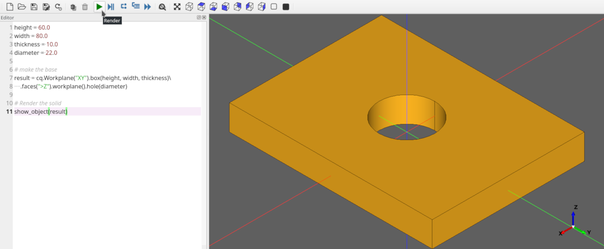

.. _quickstart:

***********************
CadQuery QuickStart
***********************

.. module:: cadquery

Want a quick glimpse of what CadQuery can do?  This quickstart will demonstrate the basics of CadQuery using a simple example

Prerequisites: conda + CQ-editor running from an environment
==============================================================

If you have not already done so, follow the :ref:`installation`, to install conda and CQ-editor.

After installation, run CQ-editor:

Find the CadQuery code editor, on the left side.  You'll see that we start out with the script for a simple block.

What we'll accomplish
========================

We will build a fully parametric bearing pillow block in this quickstart.  Our finished object will look like this:

**We would like our block to have these features:**

    1. It should be sized to hold a single 608 ( 'skate' ) bearing, in the center of the block.
    2. It should have counter-bored holes for M2 socket head cap screws at the corners.
    3. The length and width of the block should be configurable by the user to any reasonable size.

A human would describe this as:

     "A rectangular block 80mm x 60mm x 10mm , with counter-bored holes for M2 socket head cap screws
     at the corners, and a circular pocket 22mm in diameter in the middle for a bearing."

Human descriptions are very elegant, right?
Hopefully our finished script will not be too much more complex than this human-oriented description.

Let's see how we do.

Start With A single, simple Plate
======================================

Lets start with a simple model that makes nothing but a rectangular block, but
with place-holders for the dimensions. Paste this into the code editor:

.. code-block:: python
   :linenos:

    height = 60.0
    width = 80.0
    thickness = 10.0

    # make the base
    result = cq.Workplane("XY").box(height, width, thickness)

    # Render the solid
    show_object(result)

Press the green Render button in the toolbar to run the script. You should see our base object.

..  image:: _static/quickstart/002.png

Nothing special, but its a start!

Add the Holes
================

Our pillow block needs to have a 22mm diameter hole in the center to hold the bearing.

This modification will do the trick:

.. code-block:: python
   :linenos:
   :emphasize-lines: 4,8

    height = 60.0
    width = 80.0
    thickness = 10.0
    diameter = 22.0

    # make the base
    result = cq.Workplane("XY").box(height, width, thickness)\
        .faces(">Z").workplane().hole(diameter)

    # Render the solid
    show_object(result)

Rebuild your model by clicking the Render button. Your block should look like this:

The code is pretty compact, lets step through it.

**Line 4** adds a new parameter, diameter, for the diameter of the hole

**Line 8**, we're adding the hole.
:py:meth:`cadquery.Workplane.faces` selects the top-most face in the Z direction, and then
:py:meth:`cadquery.Workplane.workplane` begins a new workplane located on this face. The center of this workplane
is located at the center of mass of the shape, which in this case is the center of the plate.
Finally, :py:meth:`cadquery.Workplane.hole` drills a hole through the part, 22mm in diameter.

.. note::

    Don't worry about the CadQuery syntax now.. you can learn all about it in the :ref:`apireference` later.

More Holes
============

Ok, that hole was not too hard, but what about the counter-bored holes in the corners?

An M2 Socket head cap screw has these dimensions:

  * **Head Diameter** : 3.8 mm
  * **Head height**  : 2.0 mm
  * **Clearance Hole** : 2.4 mm
  * **CounterBore diameter** : 4.4 mm

The centers of these holes should be 6mm from the edges of the block. And,
we want the block to work correctly even when the block is re-sized by the user.

**Don't tell me** we'll have to repeat the steps above 8 times to get counter-bored holes?
Good news!-- we can get the job done with just a few lines of code. Here's the code we need:

.. code-block:: python
   :linenos:
   :emphasize-lines: 5,10-13

    height = 60.0
    width = 80.0
    thickness = 10.0
    diameter = 22.0
    padding = 12.0

    # make the base
    result = cq.Workplane("XY").box(height, width, thickness)\
        .faces(">Z").workplane().hole(diameter)\
        .faces(">Z").workplane() \
        .rect(height - padding,width - padding,forConstruction=True)\
        .vertices()\
        .cboreHole(2.4, 4.4, 2.1)

    # Render the solid
    show_object(result)

After clicking the Render button to re-execute the model, you should see something like this:

        ..  image:: _static/quickstart/004.png

There is quite a bit going on here, so lets break it down a bit.

**Line 5** creates a new padding parameter that decides how far the holes are from the edges of the plate.

**Line 10** selects the top-most face of the block, and creates a workplane on the top of that face, which we'll use to
define the centers of the holes in the corners.

There are a couple of things to note about this line:

    1. The :py:meth:`cadquery.Workplane.rect` function draws a rectangle.  **forConstruction=True**
       tells CadQuery that this rectangle will not form a part of the solid,
       but we are just using it to help define some other geometry.
    2. Unless you specify otherwise, a rectangle is drawn with its center on the current workplane center-- in
       this case, the center of the top face of the block. So this rectangle will be centered on the face.

**Line 11** draws a rectangle 12mm smaller than the overall length and width of the block, which we will use to
locate the corner holes. We'll use the vertices ( corners ) of this rectangle to locate the holes. The rectangle's
center is at the center of the workplane, which in this case coincides with the center of the bearing hole.

**Line 12** selects the vertices of the rectangle, which we will use for the centers of the holes.
The :py:meth:`cadquery.Workplane.vertices` function selects the corners of the rectangle.

**Line 13** uses the cboreHole function to draw the holes.
The :py:meth:`cadquery.Workplane.cboreHole` function is a handy CadQuery function that makes a counterbored hole. 
Like most other CadQuery functions, it operates on the values on the stack.  In this case, since we
selected the four vertices before calling the function, the function operates on each of the four points--
which results in a counterbore hole at each of the rectangle corners.

Filleting
===========

Almost done. Let's just round the corners of the block a bit. That's easy, we just need to select the edges
and then fillet them:

We can do that using the preset dictionaries in the parameter definition:

.. code-block:: python
   :linenos:
   :emphasize-lines: 13

    height = 60.0
    width = 80.0
    thickness = 10.0
    diameter = 22.0
    padding = 12.0

    # make the base
    result = cq.Workplane("XY").box(height, width, thickness)\
        .faces(">Z").workplane().hole(diameter)\
        .faces(">Z").workplane() \
        .rect(height - padding, width - padding, forConstruction=True)\
        .vertices().cboreHole(2.4, 4.4, 2.1)\
        .edges("|Z").fillet(2.0)

    # Render the solid
    show_object(result)

**Line 13** fillets the edges using the   :py:meth:`cadquery.Workplane.fillet` method.

To grab the right edges, the :py:meth:`cadquery.Workplane.edges` selects all of the
edges that are parallel to the Z axis ("\|Z"),

The finished product looks like this:

        ..  image:: _static/quickstart/005.png

Exporting
=========

If you want to fabricate a physical object you need to export the result to STL or DXF. Additionally, exporting as STEP for post-processing in another CAD tool is also possible.

This can be easily accomplished using the :py:meth:`cadquery.exporters.export` function:

.. code-block:: python
   :linenos:
   :emphasize-lines: 13

    height = 60.0
    width = 80.0
    thickness = 10.0
    diameter = 22.0
    padding = 12.0

    # make the base
    result = cq.Workplane("XY").box(height, width, thickness)\
        .faces(">Z").workplane().hole(diameter)\
        .faces(">Z").workplane() \
        .rect(height - padding, width - padding, forConstruction=True)\
        .vertices().cboreHole(2.4, 4.4, 2.1)\
        .edges("|Z").fillet(2.0)

    # Render the solid
    show_object(result)
    
    # Export
    cq.exporters.export(result,'result.stl')
    cq.exporters.export(result.section(),'result.dxf')
    cq.exporters.export(result,'result.step')

Done!
============

You just made a parametric, model that can generate pretty much any bearing pillow block
with < 20 lines of code.

Want to learn more?
====================

   * The :ref:`examples` contains lots of examples demonstrating cadquery features
   * The :ref:`apireference` is a good overview of language features grouped by function
   * The :ref:`classreference` is the hard-core listing of all functions available.
