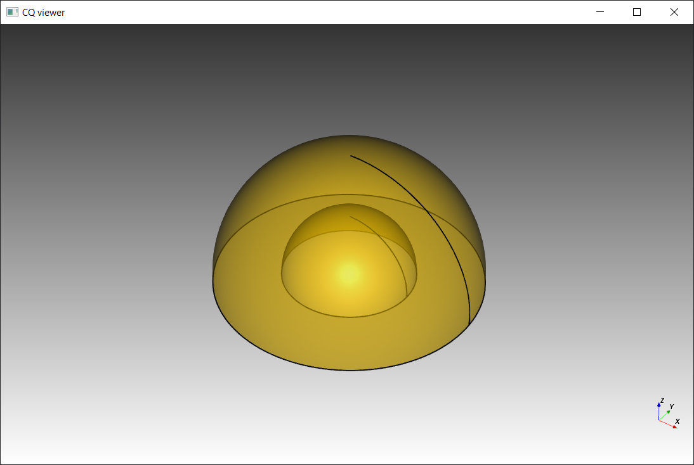
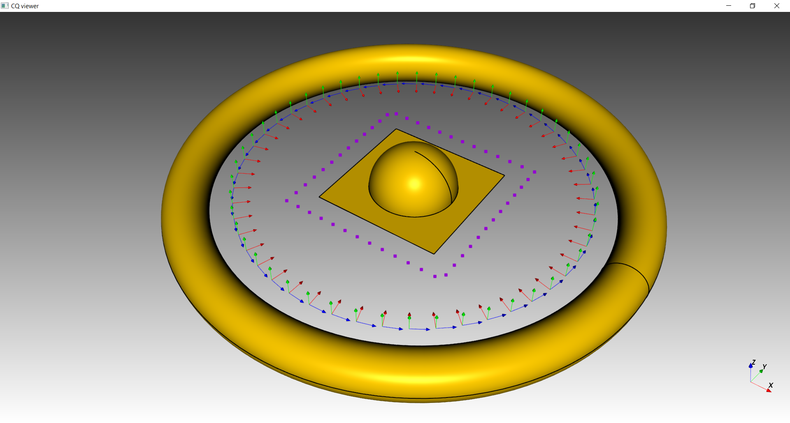
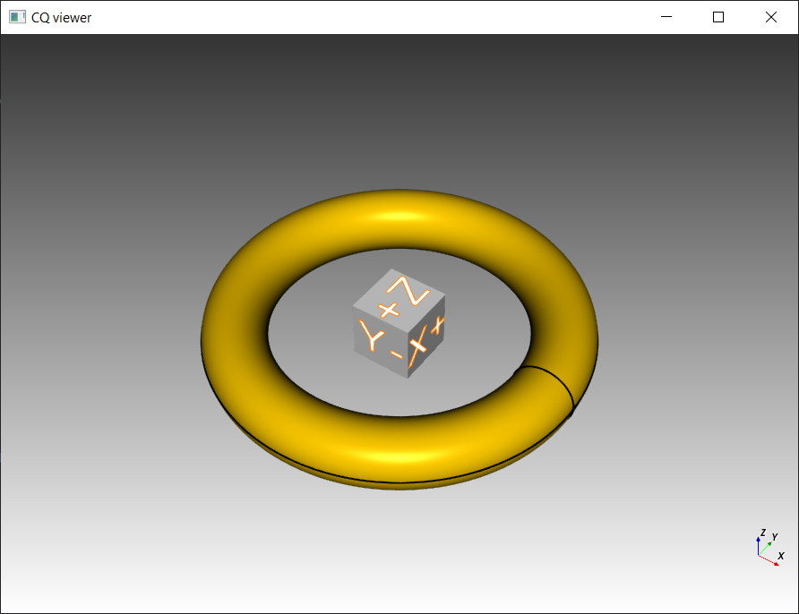
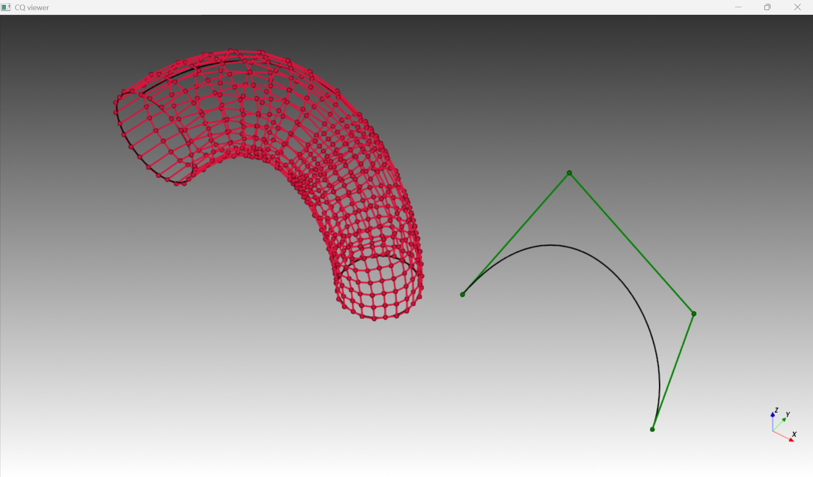
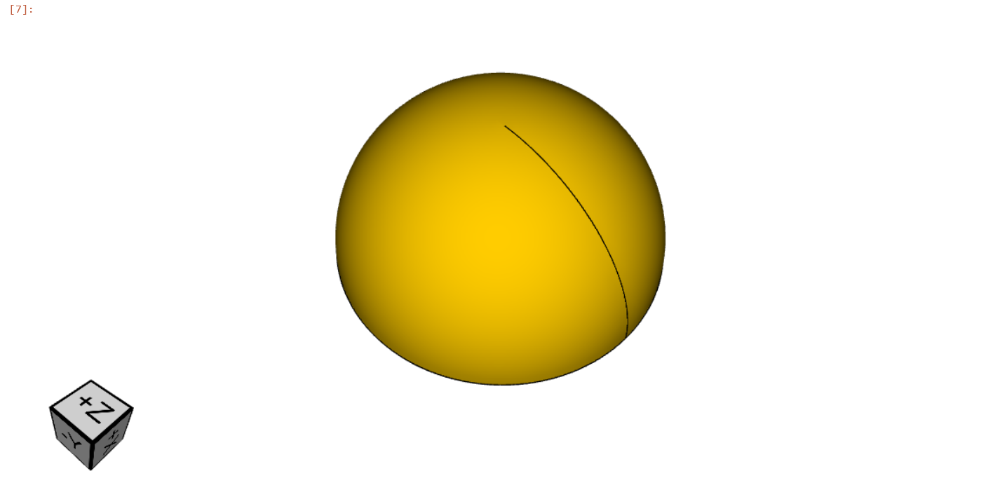

.. _vis:

===========================
Visualization
===========================

Pure Python
===========

Since version 2.4 CadQuery supports visualization without any external tools. Those facilities are based on the VTK library
and are not tied to any external tool.

.. code-block:: python

    from cadquery import *
    from cadquery.vis import show

    w = Workplane().sphere(1).split(keepBottom=True) - Workplane().sphere(0.5)
    r = w.faces('>Z').fillet(0.1)

    # Show the result
    show(r, alpha=0.5)

One can visualize objects of type :class:`~cadquery.Workplane`, :class:`~cadquery.Sketch`, :class:`~cadquery.Assembly`, :class:`~cadquery.Shape`,
:class:`~cadquery.Vector`, :class:`~cadquery.Location` and lists thereof.

.. code-block:: python

   from cadquery import *
   from cadquery.func import *
   from cadquery.vis import show

   w = Workplane().sphere(0.5).split(keepTop=True)
   sk = Sketch().rect(1.5, 1.5)
   sh = torus(5, 0.5)

   r = rect(2, 2)
   c = circle(2)

   N = 50
   params = [i/N for i in range(N)]

   vecs = r.positions(params)
   locs = c.locations(params)

   # Render the solid
   show(w, sk, sh, vecs, locs)

Additionally it is possible to integrate with other libraries using VTK and display any `vtkProp` object.

.. code-block:: python

    from cadquery.vis import show
    from cadquery.func import torus

    from vtkmodules.vtkRenderingAnnotation import vtkAnnotatedCubeActor

    a = vtkAnnotatedCubeActor()
    t = torus(5,1)

    show(t, a)

Note that currently the show function is blocking.

Screenshots
===========

:meth:`~cadquery.vis.show` allows additionally to take screenshots in `png` format. One can specify zoom,
camera position and windows size.

.. code-block:: python

    from cadquery.vis import show
    from cadquery.func import box

    b = box(1,1,1)

    show(b, width=800, height=800, screenshot='img.png', zoom=2, roll=-20, elevation=-30, interact=False)

NB: intermittent issues were observed with this functionality, please submit detailed bug reports in case
of problems.

Control points
==============

:meth:`~cadquery.vis.ctrlPts` allows to visualize control points of surfaces and curves.

.. code-block:: python

    from cadquery.func import *
    from cadquery.vis import *

    c = circle(1).toSplines()
    spine = spline([(0, 0, 0), (-3, -3, 5)], tgts=[(0, 0, 1), (0, -1, 0)])
    f = sweep(c, spine)

    show(
        f,
        ctrlPts(f),
        spine.moved(x=7),
        ctrlPts(spine.moved(x=7), color="green"),
        alpha=0.0,
    )

Note that for some geometries explicit conversion to spline representation might be needed.
:meth:`~cadquery.Shape.toSplines` performs approximate conversion and :meth:`~cadquery.vis.toNURBS`
performs exact one.

Jupyter/JupterLab
=================

There is also more limited support for displaying :class:`~cadquery.Workplane`, :class:`~cadquery.Sketch`, :class:`~cadquery.Assembly`,
:class:`~cadquery.Shape` in Jupyter and JupyterLab. This functionality is implemented using VTK.js.

.. code-block:: python

    from cadquery import *

    Workplane().sphere(1).split(keepTop=True)

